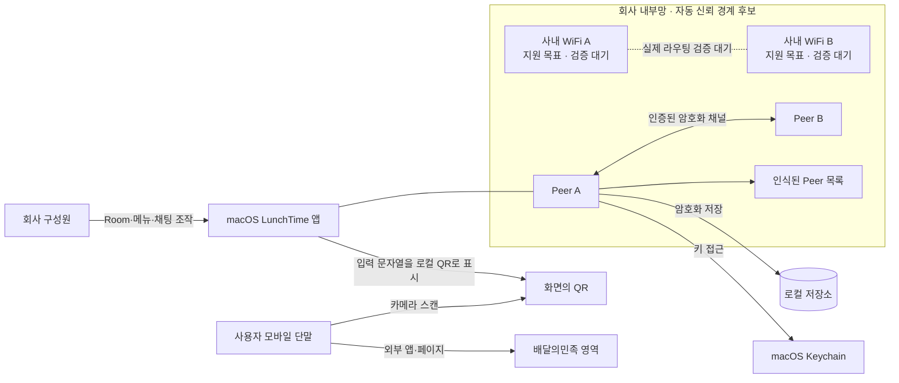
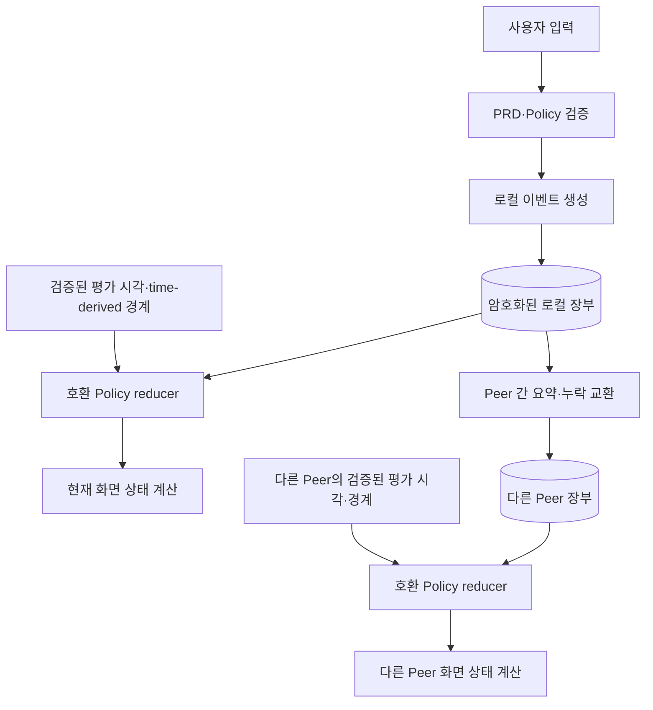

# 01. 시스템 컨텍스트와 신뢰 경계

이 문서는 “LunchTime은 어떤 시스템이며 사용자, macOS 앱, Peer, 내부망,
로컬 저장소와 외부 단말은 어떤 관계인가?”에 답한다. 기능·상태 규칙은
정본을 참조하고 여기서는 시스템과 신뢰 경계만 설명한다.

## 한눈에 보기

- 사용자는 macOS 앱을 조작하고, 각 앱 설치는 로컬 장부와 Peer 식별을 가진
  하나의 Peer로 동작한다.
- 구조화된 운영 데이터는 로컬에 보호해 저장되고, Peer 사이는 인증된 암호화
  채널로 필요한 데이터만 이동한다.
- 두 사내 WiFi는 같은 내부망 지원 목표지만 교차망 discovery·routing은 실제
  환경의 검증이 끝나지 않았다.
- 모바일 단말과 배달의민족은 Peer 네트워크 밖에 있으며, 화면의 QR을 통한
  사용자 주도 경로로만 연결된다.
- 중앙 서버, 전역 관리자와 항상 온라인인 정본은 없으므로 단절 중 실시간
  동기화와 모든 복제본의 완전 삭제는 보장하지 않는다.

## 시스템 경계

LunchTime의 실행 경계는 macOS 앱 설치 단위다. 설치마다 Peer 역할, 화면,
메모리 데이터, 암호화된 로컬 저장소와 Keychain에 분리된 키를 가진다. 한
기기가 방 생성자이더라도 중앙 리더나 영구 정본이 되지 않으며, 검증된 이벤트
집합·Policy reducer와 Policy가 검증한 시간 경계 입력에서 각 Peer가 화면
상태를 다시 계산한다. 현재 시각에서 파생되는 일일 상태는 장부 event가 아니라
별도 time-derived 입력이다. 시간 경계와 시계 검증 결과는
[POL-01-R-01](../policies/01_daily_room_lifecycle.md)과
[POL-02-R-08](../policies/02_replication_consistency_retention.md)을 입력
계약으로 사용한다.

LunchTime이 운영하는 별도 중앙 서버나 데이터베이스는 시스템 안에 없다.
Peer discovery와 연결이 끊겨도 각 앱은 이미 검증해 보유한 로컬 데이터를
표시할 수 있지만, 보지 못한 원격 변경까지 추측해 최신이라고 표시할 수는
없다. 이 경계는 [POL-02-R-01과 POL-02-R-03](../policies/02_replication_consistency_retention.md)을
입력 계약으로 사용한다.

## 참여 구성요소

| 구성요소 | 책임 | 소유하지 않는 책임 |
|---|---|---|
| 사용자 | 닉네임 설정, Room 동작, 수동 새로고침, QR 스캔 | Peer 합의나 복제본 관리 |
| macOS LunchTime 앱 | UI, 정책 검증, 이벤트 생성·projection, 연결·복구 조정 | 중앙 권한·중앙 정본 |
| Peer | 설치·기기 식별, 장부 요약·이벤트 교환, ACK | 사람의 강한 신원 인증 |
| 인식된 Peer 목록 | 닉네임, 연결·동기화 관측 정보 연결 | 접근 차단 목록이나 별도 신뢰 관리 |
| 로컬 저장소 | 구조화된 운영 이벤트, 삭제 표식, Peer 정보, 최소 히스토리의 암호화 보관 | Keychain 키와 채팅 본문의 영속 보관 |
| 프로세스 메모리 | 현재 운영일 채팅과 일시적 연결 상태 | 앱 재실행 뒤 영구 복구 |
| macOS Keychain | 기기 개인키와 로컬 데이터 키 보관 | 운영 이벤트 본문 저장 |
| 사내 내부망 | Peer discovery·직접 연결의 후보 경로 | 회사 구성원 신원 증명 |
| 모바일 단말·배달의민족 | 화면 QR 스캔 뒤 외부 주문 흐름 | LunchTime Peer 또는 복제 참여자 |

세부 저장 수명과 보호 경로는 [05. 저장과 보안](./05_storage_and_security.md),
Peer 연결 과정은 [02. Peer 네트워크와 전송](./02_peer_network_and_transport.md)이
맡는다.

## 신뢰 경계

### 지원 네트워크 경계

[POL-03-R-01](../policies/03_security_and_trust.md)은 실제로 같은 내부망에서
Peer 통신을 허용하는 두 종류의 회사 WiFi를 지원 대상으로 둔다. 이는
**지원 목표**이며, 같은 SSID와 교차 SSID에서 discovery·routing이 가능한지는
`PRD-01-SP-01`과 `POL-03-R-07`의 검증 대기 항목이다.

지원 범위로 판정되지 않은 인터넷, 외부망, VPN, 개인 핫스팟에는 운영 데이터를
보내지 않는다. 지원 범위를 확인할 수 없을 때도 연결을 성공으로 추정하지
않고 데이터 교환을 차단하는 fail-closed 경로를 사용한다.

### Peer 신뢰 경계

지원 네트워크에서 발견하고 프로토콜·암호 채널 검증을 통과한 LunchTime
Peer는 사용자별 승인 없이 자동 신뢰된다. 채널 상대가 기기 키를 보유했다는
확인은 기기 연속성과 메시지 무결성을 위한 것이지, 그 사용자가 특정 회사
구성원임을 강하게 인증하는 절차가 아니다.

닉네임은 표시값이고 사용자 ID·기기 ID와 분리된다. 권한 판정과 표시의 정확한
계약은 [POL-03-R-02](../policies/03_security_and_trust.md), Peer 목록에 보일
정보는 [POL-04-R-07](../policies/04_surfaces_and_chat.md)이 소유한다.

### 외부 QR 경계

QR 생성은 사용자가 입력한 문자열을 앱 안에서 화면 이미지로 바꾸는 작업이다.
모바일 단말은 화면을 스캔한 뒤 외부 앱이나 페이지로 이동하며 LunchTime의
Peer 인증·복제 경계에는 들어오지 않는다. QR에 내부 식별자·메뉴·채팅·키를
싣지 않는 계약과 외부 동작의 비보장은
[POL-03-R-05](../policies/03_security_and_trust.md)를 따른다.

## 확정 계약

- 중앙 서버 없이 각 Peer가 로컬 복제본을 보유한다:
  [PRD-01-FR-09](../prd/01_lunchtime_mvp.md),
  [POL-02-R-01](../policies/02_replication_consistency_retention.md).
- 지원 회사 WiFi에서 발견한 Peer를 자동 신뢰하되 강한 개인 인증으로
  표현하지 않는다:
  [POL-03-R-01](../policies/03_security_and_trust.md),
  [POL-03-R-06](../policies/03_security_and_trust.md).
- 전송 데이터와 로컬 중요 데이터는 보호하고 장기 키는 Keychain에서
  관리한다:
  [POL-03-R-02](../policies/03_security_and_trust.md),
  [POL-03-R-03](../policies/03_security_and_trust.md),
  [POL-03-R-04](../policies/03_security_and_trust.md).
- 사용자는 연결·동기화 상태와 수동 복구 진입점을 확인한다:
  [PRD-01-FR-10](../prd/01_lunchtime_mvp.md),
  [POL-04-R-07](../policies/04_surfaces_and_chat.md).
- 모바일 전달은 로컬 QR 표시까지이며 스캔 뒤 외부 동작은 시스템 보장이
  아니다:
  [POL-03-R-05](../policies/03_security_and_trust.md).

## 논리 모델

각 Peer의 화면은 네트워크 응답 자체가 아니라 검증된 로컬 이벤트 집합,
호환 Policy reducer와 검증된 평가 시각·time-derived 경계의 projection이다.
평가 시각 입력이 다르면 같은 장부에서도 순간 일일 상태가 다를 수 있다.
로컬 기록, 다른 Peer의 정확한 리비전 저장 ACK, 현재 응답 Peer와의 장부
대조는 서로 다른 관측 결과이며 화면 상태는
[POL-02-R-03](../policies/02_replication_consistency_retention.md)이 정한
표현을 사용한다.

Peer 목록도 별도 중앙 디렉터리가 아니라 로컬에서 관측한 식별·연결 정보의
projection이다. 한 Peer의 목록이 다른 Peer와 항상 같다는 가정은 하지 않는다.

## 실패와 복구

| 실패 | 안전한 처리 | 복구 진입점 |
|---|---|---|
| 지원 네트워크 판정 불가 | Peer 노출·운영 데이터 교환을 성공으로 처리하지 않음 | 네트워크 변화 뒤 재탐색 |
| Peer discovery·연결 실패 | 기존 로컬 상태를 유지하고 최신성 미확인을 표시 | 새 의미 있는 트리거 또는 수동 새로고침 |
| 인증·무결성·복호화 실패 | 응답과 이벤트를 적용하지 않고 정상 응답 Peer에서 제외 | 새 제한 세션, 지속 실패 시 사용자 안내 |
| Mac sleep·앱 종료 | 실시간 통신을 보장하지 않음 | wake·앱 실행 뒤 장부 대조 |
| 외부 QR 동작 실패 | 내부 Room 상태나 주문 성공으로 추론하지 않음 | 사용자가 입력·QR 표시를 다시 확인 |
| 키·암호화 저장소 접근 실패 | 평문으로 낮춰 저장하거나 동기화하지 않음 | 안전 차단 상태를 노출하고 키·저장소 진단 |

동기화 세션의 정확한 종료 조건과 재개 트리거는
[POL-02-R-02](../policies/02_replication_consistency_retention.md), 인증 실패의
화면 결과는 [PRD-01-FR-12](../prd/01_lunchtime_mvp.md)를 입력으로 삼는다.

## 보장하지 않는 범위

- 두 사내 WiFi 사이의 실제 discovery·routing 성공
- Peer, 앱 또는 Mac이 항상 온라인이라는 가정
- 중앙 리더, 전역 합의, 강한 정합성 또는 단절 중 실시간 반영
- 닉네임이나 회사 WiFi만으로 확인되는 개인의 강한 신원
- 자동 신뢰된 내부 악성 Peer의 평문 열람과 허용 권한 안의 악성 동작 방어
- 모든 Peer 복제본의 즉시·영구 삭제
- QR 스캔 뒤 배달의민족 앱·페이지의 실행과 실제 주문 성공
- 기술 스파이크로 확인하지 않은 Peer 수·지연·자원 사용 범위

## 미결정 기술

| 항목 | 현재 상태 | 확정 경로 |
|---|---|---|
| 두 WiFi의 같은·교차 망 discovery와 routing | 지원 목표, 검증 대기 | `PRD-01-SP-01`, `POL-03-R-07` |
| 지원 네트워크 자동 판정 방식 | 미결정 | `PRD-01-SP-01`, `PRD-01-SP-04` |
| 실제 discovery·transport API | 미결정 | [02](./02_peer_network_and_transport.md)의 스파이크 |
| 지원 Peer 규모와 성능 범위 | 미결정 | `PRD-01-SP-06` 파일럿 |
| 암호 프로토콜·키 교환·회전 | 미결정 | [05](./05_storage_and_security.md), `PRD-01-SP-04` |

## 관련 계약과 결정

- PRD: [PRD-01](../prd/01_lunchtime_mvp.md) `PRD-01-FR-09`,
  `PRD-01-FR-10`, `PRD-01-FR-12`, `PRD-01-AC-03`, `PRD-01-AC-08`
- Policy: [POL-01](../policies/01_daily_room_lifecycle.md) `POL-01-R-01`;
  [POL-02](../policies/02_replication_consistency_retention.md)
  `POL-02-R-01`, `POL-02-R-02`, `POL-02-R-03`, `POL-02-R-08`;
  [POL-03](../policies/03_security_and_trust.md) `POL-03-R-01`,
  `POL-03-R-02`, `POL-03-R-03`, `POL-03-R-04`, `POL-03-R-05`,
  `POL-03-R-06`, `POL-03-R-07`;
  [POL-04](../policies/04_surfaces_and_chat.md) `POL-04-R-07`
- 결정: [결정 목록](../product-definition/10_decision_backlog.md) `D-02`,
  `D-03`, `D-20`, `D-28`, `D-34`, `D-35`, `D-38`, `D-42`, `D-43`

## 함께 읽기

- 다음 흐름: [02. Peer 네트워크와 전송](./02_peer_network_and_transport.md)
- 데이터 수명과 보호: [05. 저장과 보안](./05_storage_and_security.md)
- 문서 선택으로 돌아가기: [아키텍처 인덱스](./README.md)
