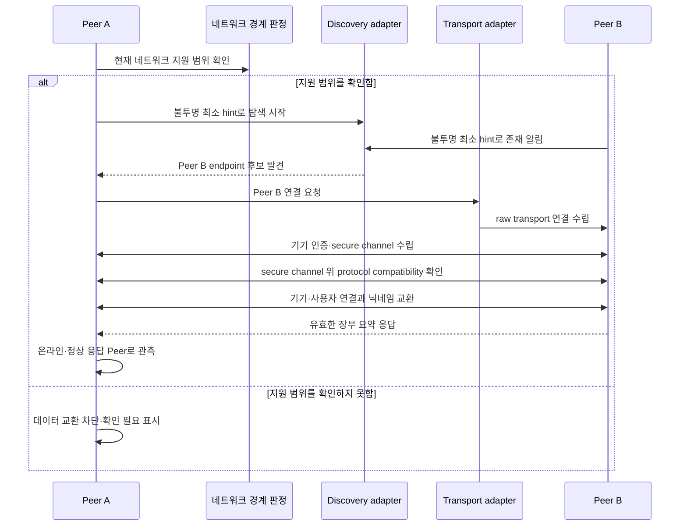
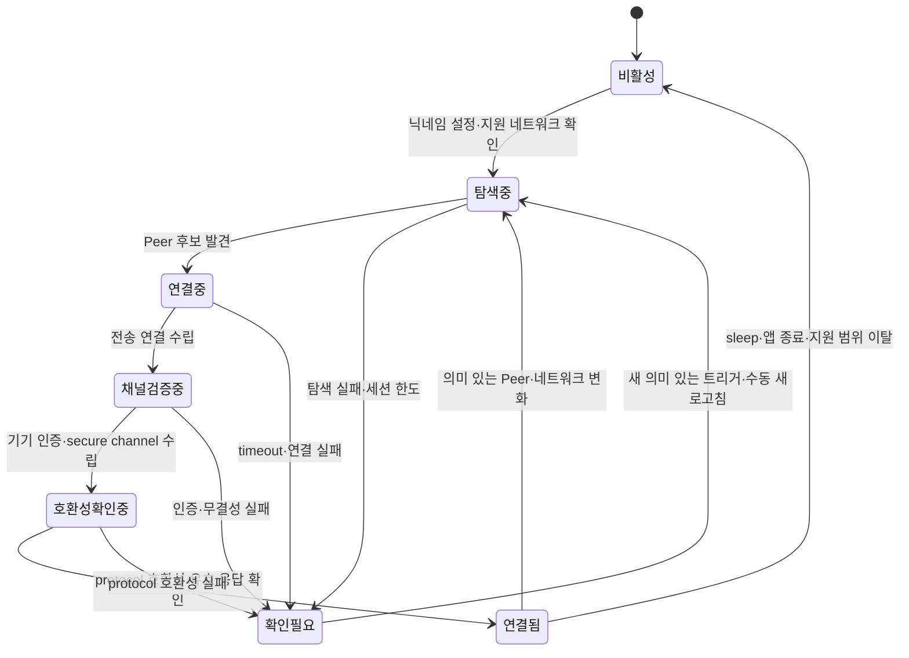

# 02. Peer 네트워크와 전송

이 문서는 “Peer들은 지원 네트워크를 어떻게 확인하고 서로를 발견해 통신
가능한 연결을 만드는가?”에 답한다. 특정 Apple API나 전송 프로토콜을
선택하지 않고 discovery와 connection lifecycle의 논리 계약을 설명한다.

## 한눈에 보기

- 지원 네트워크 판정, Peer discovery, 전송 연결, 기기 인증, 프로토콜
  호환성 확인은 서로 다른 단계다.
- 발견 패킷에는 불투명 최소 hint와 endpoint 정보만 허용하고 닉네임,
  안정적 기기 ID, 사용자 ID, 공개키 fingerprint와 사용자 데이터를 싣지 않는다.
- 암호 채널과 유효한 응답을 확보한 뒤에만 Peer를 현재 세션의 정상 응답
  대상으로 계산한다.
- 네트워크 변화, sleep, 앱 종료와 timeout은 연결을 끊을 수 있으며 새 의미
  있는 트리거에서 제한된 생명주기를 다시 시작한다.
- 실제 discovery·transport 기술과 두 WiFi 사이의 도달성은 검증 전에는
  확정하거나 연결 성공을 보장하지 않는다.

## 연결 생명주기

이 상태도는 구현 구성요소의 **논리적 연결 단계**이며 사용자에게 보이는
정식 상태 열거형을 새로 정의하지 않는다. 사용자 화면에는
[POL-02-R-03](../policies/02_replication_consistency_retention.md)과
[POL-04-R-07](../policies/04_surfaces_and_chat.md)이 소유한 연결·동기화
정보만 projection한다.

### 1. 활성화 전 조건

첫 실행에서 닉네임이 설정되기 전에는 Peer로 노출하거나 Room 쓰기를
허용하지 않는다. 닉네임은 discovery 이름이나 권한 키로 사용하지 않고,
discovery packet에도 넣지 않는다. 설치·기기에 결합한 안정적인 기기 ID와
사용자 ID는 기기 인증·secure channel·protocol compatibility 확인 뒤 채널
안에서 닉네임과 함께 교환한다. 이 식별 계약은
[POL-03-R-02](../policies/03_security_and_trust.md)가 소유한다.

현재 네트워크가 지원 범위인지 판정할 수 있어야 discovery를 시작한다. 두
사내 WiFi는 지원 목표지만 실제 같은·교차 SSID 연결 가능성과 자동 판정
방식은 `PRD-01-SP-01`·`PRD-01-SP-04`의 검증 대기 항목이다.

### 2. Peer discovery

Discovery adapter는 구현 기술과 무관하게 다음 역할만 노출한다.

1. 지원 범위에서 로컬 Peer의 불투명 최소 hint와 연결 endpoint를 알린다.
2. 발견·소실·주소 변화 같은 의미 있는 관측을 연결 조정자에게 전달한다.
3. 닉네임, 안정적 기기 ID, 사용자 ID, 공개키 fingerprint와 Room·메뉴·채팅
   정보를 발견 packet에 넣지 않는다.
4. 지원 범위를 벗어난 후보를 연결 대상으로 승격하지 않는다.

불투명 최소 hint가 어떤 값이고 반복 발견 후보를 어느 범위에서 같은 후보로
묶는지는 기술 스파이크의 미결정 사항이다. 이 hint를 안정적 기기 ID나
사용자 식별자로 확정하지 않는다. 검증된 안정적 기기 ID와 discovery 후보의
연결은 raw transport 뒤 기기 인증·secure channel을 통과한 다음에만 만든다.
[POL-03-R-03](../policies/03_security_and_trust.md)의 평문 금지 범위를
넘어서는 정보를 미리 가정하지 않는다.

### 3. 전송 연결과 채널 검증

Transport adapter는 발견 결과를 이용해 양방향 바이트 경로를 만들되,
연결 성공 자체를 신뢰 성공으로 해석하지 않는다. 애플리케이션 데이터 교환
전에는 다음 논리 단계를 통과해야 한다.

1. Discovery endpoint로 **raw transport** 양방향 바이트 경로를 만든다.
2. 상대 기기 키 보유를 인증하고 [05. 저장과 보안](./05_storage_and_security.md)이
   정의한 보장을 만족하는 **secure channel**을 수립한다.
3. Secure channel 위에서 [03. 통신 프로토콜](./03_communication_protocol.md)이
   정의한 **protocol compatibility** 결과를 확인한다.
4. 호환되는 채널 안에서 안정적 기기 ID·사용자 ID·공개키 연결과 닉네임을
   교환한 뒤 애플리케이션 메시지를 시작한다.

`02`는 이 연결 수립 순서를 조정하고, `03`은 secure channel 위 메시지의
의미를, `05`는 기기 인증과 channel 보안을 소유한다. 암호 방식과 handshake
wire format은 [05. 저장과 보안](./05_storage_and_security.md)의 미결정
기술이다. 위 네 단계가 끝나기 전에 Room·메뉴·채팅·입력 링크를 보내지 않는다.

### 4. 연결됨과 정상 응답 Peer

암호 채널이 열려 있다는 사실만으로 Peer를 정상 응답 대상으로 세지 않는다.
현재 제한 세션 안에서 유효한 장부 요약이나 요청 응답을 받은 Peer만
[POL-02-R-03](../policies/02_replication_consistency_retention.md)의 정상
응답 Peer가 된다. 인증·복호화 실패, timeout 또는 지원 범위 밖 Peer는
대상에서 제외한다.

연결 화면의 온라인 여부는 현재 transport 관측이고, 동기화 상태는 장부 대조
결과다. 둘은 같은 의미가 아니며 Peer별 ACK 보유 여부나 별도 신뢰 상태를
화면에 노출하지 않는다.

### 5. 종료와 재시작

다음 사건은 현재 채널을 닫거나 기존 endpoint를 무효화할 수 있다.

- 네트워크 인터페이스·지원 WiFi 변경
- Peer 주소·발견 정보 변경 또는 소실
- Mac sleep
- 앱 종료
- 인증·무결성 실패
- 정책이 정한 세션 한도에 도달한 timeout·전송 실패

앱 실행, wake, foreground, 네트워크 변화, 의미 있는 새 Peer 발견과 수동
새로고침이 새 제한 세션의 진입점이다. 정확한 트리거, timeout·재시도 한도와
주기 대조 조건은 [POL-02-R-02](../policies/02_replication_consistency_retention.md)가
소유하며 transport가 임의의 무한 재연결 루프를 추가하지 않는다.

## Peer 목록과 닉네임

Peer directory는 discovery의 불투명 후보 자체를 사용자로 보관하지 않는다.
기기 인증·secure channel·protocol compatibility 뒤 채널 안에서 받은
검증된 안정적 기기 ID를 후보 연결과 매핑해 로컬에 보관한다. 같은 기기 ID가
다시 나타나면 기존 항목을 갱신하고, 채널 안에서 받은 닉네임이 겹칠 때만
화면에서 안정적인 짧은 접미사를 붙인다.

| 값 | 용도 | 사용하지 않는 용도 |
|---|---|---|
| 불투명 discovery hint | raw transport 후보를 찾는 최소 단서 | 안정적 기기·사용자 식별 |
| 안정적 기기 ID | 인증된 채널 뒤 동일 설치의 재연결 관측 | discovery 평문 식별자·사람의 강한 신원 증명 |
| 사용자 ID | 참여·메뉴 소유권과 정책 권한 | 화면 표시 이름 |
| 공개키 연결 | 세션 상대의 기기 연속성 확인 | 회사 재직자 인증 |
| 닉네임 | Peer·참여자 표시 | 인증·소유권·충돌 판정 |
| 온라인 관측 | 현재 연결 가능성 표시 | 모든 데이터가 최신이라는 판정 |

화면 표시와 로컬 보존 규칙의 정확한 범위는
[POL-02-R-07](../policies/02_replication_consistency_retention.md),
[POL-04-R-07](../policies/04_surfaces_and_chat.md)을 따른다.

## 확정 계약

- 지원 회사 WiFi 밖에서는 Peer를 자동 신뢰하거나 운영 데이터를 보내지
  않는다: [POL-03-R-01](../policies/03_security_and_trust.md).
- 발견 뒤 모든 애플리케이션 데이터는 인증된 암호화 채널로 교환한다:
  [POL-03-R-03](../policies/03_security_and_trust.md).
- 닉네임과 권한 식별자를 분리하고 첫 실행의 노출 조건을 지킨다:
  [POL-03-R-02](../policies/03_security_and_trust.md).
- 자동·수동 연결 복구는 정책이 정한 유한한 세션으로 끝낸다:
  [POL-02-R-02](../policies/02_replication_consistency_retention.md).
- 정상 응답 Peer는 인증·유효 응답·현재 세션 조건으로 판정한다:
  [POL-02-R-03](../policies/02_replication_consistency_retention.md).

## 논리 모델

| 추상 경계 | 입력 | 출력 | 구현 후보와의 관계 |
|---|---|---|---|
| Network boundary | 현재 인터페이스·WiFi 관측 | 지원 / 비지원 / 확인 불가 | SSID·route·interface 판정 방식 미결정 |
| Discovery adapter | 지원 네트워크, 불투명 최소 hint | endpoint 후보 발견·소실 | hint 값, Bonjour, mDNS 등 모두 미결정 |
| Transport adapter | Peer endpoint | raw 양방향 연결·timeout·종료 사건 | Network.framework, QUIC 등은 후보일 뿐 |
| Secure channel | raw transport, 기기 키 | 인증·암호화된 메시지 경로 | 보안 계약은 `05`, 암호 suite·키 협상은 미결정 |
| Protocol compatibility | secure channel, 호환성 정보 | 애플리케이션 메시지 허용/차단 | 의미는 `03`, wire 표현은 미결정 |
| Connection coordinator | 위 단계의 사건 | Peer directory·sync trigger | 정책 한도와 앱 생명주기 결합 |

이 추상 경계 덕분에 기술 스파이크가 특정 API를 채택하거나 기각해도 상위의
프로토콜·복제 의미는 바뀌지 않는다.

## 실패와 복구

| 실패 지점 | 처리 | 사용자가 관측할 결과 |
|---|---|---|
| 네트워크 지원 여부 불명 | discovery·운영 데이터 교환 차단 | 비지원/확인 불가 안내와 `확인 필요` |
| Peer가 발견되지 않음 | 로컬 데이터 유지, 원격 최신성 추정 금지 | 발견 Peer 수·마지막 확인 시각 |
| 연결 timeout | 현재 시도를 종료하고 정책 한도 안에서만 재시도 | `동기화 중` 뒤 안정 상태 또는 `확인 필요` |
| 인증·무결성·복호화 실패 | 연결 종료, 응답·이벤트 미적용 | 실패 원인 안내와 수동 새로고침 |
| 호환되지 않는 protocol | 애플리케이션 데이터 교환 전 안전 종료 | 호환성 확인 필요 |
| sleep·네트워크 전환 | 기존 channel·endpoint 폐기 | wake·변화 트리거에서 자동 재대조 |
| 앱 종료 | 채널과 메모리 연결 상태 종료 | 다음 실행에서 discovery부터 재개 |

실패 세션은 단순 타이머만으로 무한 재시작하지 않는다. 새 의미 있는 trigger가
없으면 멈추고 현재 안정 상태와 마지막 확인 시각을 유지한다.

## 보장하지 않는 범위

- 두 사내 WiFi가 실제로 같은 broadcast·multicast·routing 영역이라는 보장
- Bonjour, mDNS, MultipeerConnectivity, Network.framework, QUIC 또는
  특정 전송 API의 채택
- Mac sleep·앱 종료 중 실시간 연결·메시지 전달
- 발견됨·온라인임과 데이터 최신성이 같다는 가정
- 닉네임 또는 공개키만으로 회사 구성원 개인을 강하게 인증하는 것
- 지원 범위에서 자동 신뢰된 내부 악성 Peer의 허용 권한 안 동작 방어
- 정책 한도 밖의 무한 timeout·재시도·polling

## 미결정 기술

| 질문 | 후보·검증 범위 | 확정 전 처리 |
|---|---|---|
| 같은·교차 SSID discovery가 가능한가? | 실제 두 WiFi의 라우팅·multicast 시험 | 지원 목표·검증 대기로 표시 |
| discovery는 무엇으로 구현하는가? | mDNS, Bonjour, 대체 발견 흐름 | 어느 후보도 확정 기술로 표기하지 않음 |
| 불투명 discovery hint는 무엇인가? | endpoint 연결성·최소 노출·중복 후보 처리 시험 | 안정적 기기 ID 노출로 확정하지 않음 |
| transport는 무엇으로 구현하는가? | Network.framework, MultipeerConnectivity, QUIC 등 | 논리 adapter 뒤에 격리 |
| 지원 네트워크를 어떻게 판정하는가? | interface·SSID·route 조합과 오탐 차단 시험 | 판정 불가 시 fail-closed |
| 연결 timeout을 어떻게 배분하는가? | 정책 세션 한도 안의 단계별 예산 | 임의 수치를 아키텍처 계약으로 추가하지 않음 |
| protocol 호환성을 어떻게 협상하는가? | version·capability 표현과 downgrade 차단 | 불확실하면 데이터 교환 전 종료 |

위 항목은 `PRD-01-SP-01`, `PRD-01-SP-03`, `PRD-01-SP-04`와
[POL-03-R-07](../policies/03_security_and_trust.md)의 시험 증거로 확정한다.

## 관련 계약과 결정

- PRD: [PRD-01](../prd/01_lunchtime_mvp.md) `PRD-01-FR-09`,
  `PRD-01-FR-10`, `PRD-01-FR-12`, `PRD-01-AC-03`, `PRD-01-AC-08`
- Policy: [POL-02](../policies/02_replication_consistency_retention.md)
  `POL-02-R-02`, `POL-02-R-03`, `POL-02-R-07`;
  [POL-03](../policies/03_security_and_trust.md) `POL-03-R-01`,
  `POL-03-R-02`, `POL-03-R-03`, `POL-03-R-07`;
  [POL-04](../policies/04_surfaces_and_chat.md) `POL-04-R-07`
- 결정: [결정 목록](../product-definition/10_decision_backlog.md) `D-16`,
  `D-20`, `D-27`, `D-32`, `D-35`, `D-42`, `D-43`

## 함께 읽기

- 이전 경계: [01. 시스템 컨텍스트](./01_system_context.md)
- 다음 흐름: [03. 통신 프로토콜](./03_communication_protocol.md)
- 복귀 뒤 데이터 복구: [04. 복제·정합성·복구](./04_replication_consistency_and_recovery.md)
- 문서 선택으로 돌아가기: [아키텍처 인덱스](./README.md)
