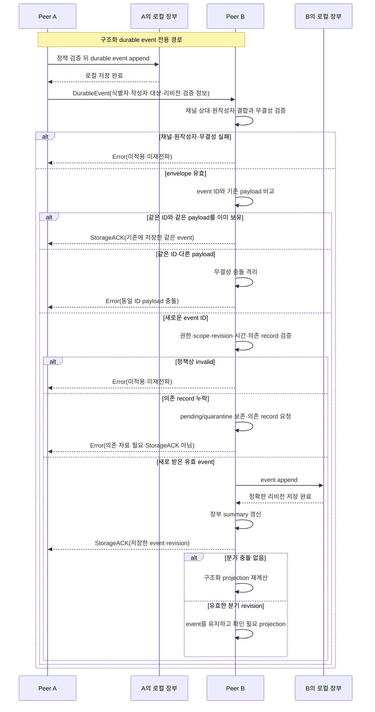
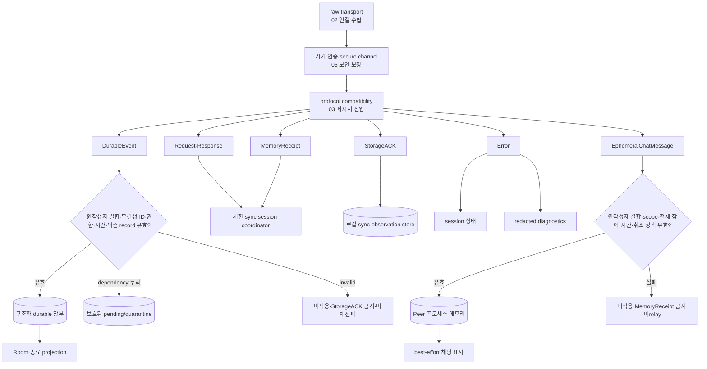
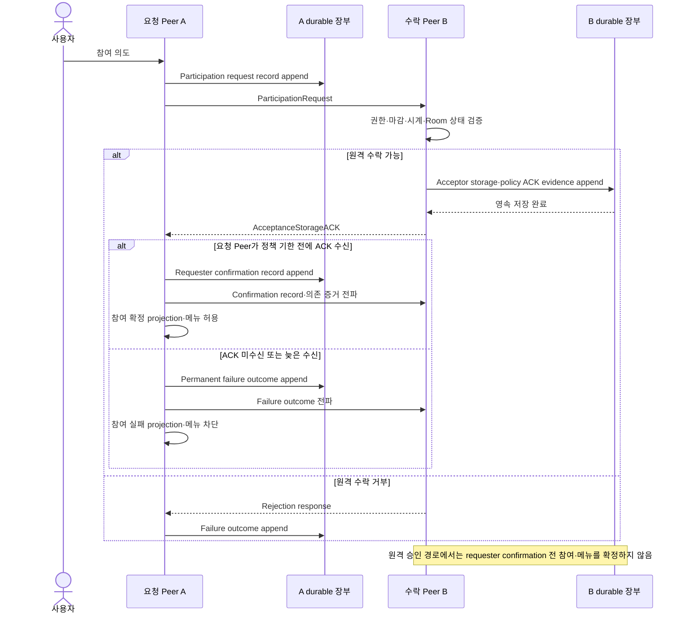
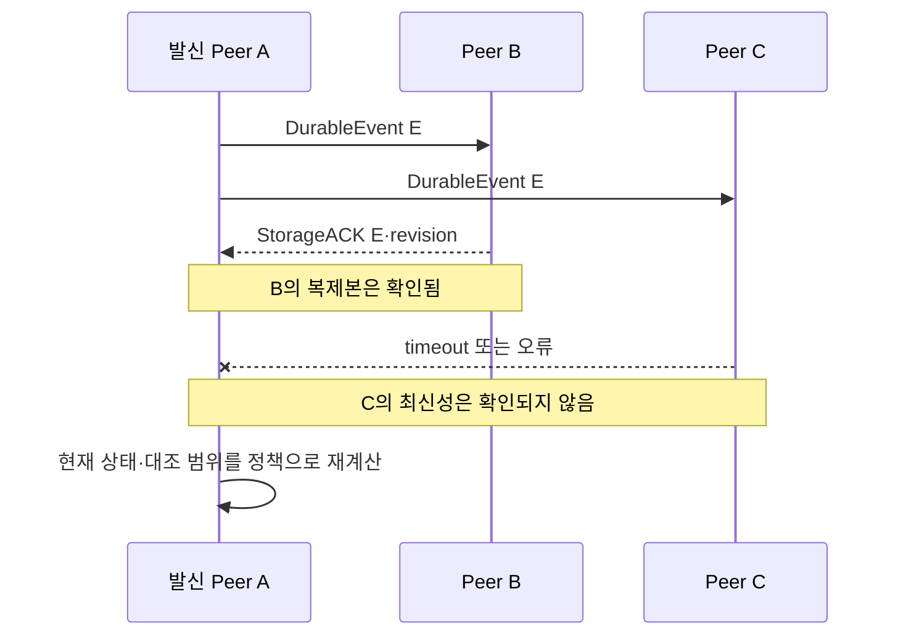

# 03. Peer 통신 프로토콜

이 문서는 “연결된 Peer들은 어떤 종류의 메시지를 어떤 의미와 순서로
교환하는가?”에 답한다. 메시지의 필수 의미를 설명하되 wire schema,
직렬화 형식과 버전 협상 방식은 확정하지 않는다.

## 한눈에 보기

- 이 첫 sequence는 **구조화 durable event 전용**이며, sync control과
  ephemeral chat은 검증·저장·ACK·복구 lane을 공유하지 않는다.
- 채널 상대·원작성자 결합과 무결성을 먼저 확인하고 같은 event ID의 payload를
  비교한 뒤, 새로운 event만 권한·scope·revision·시간·의존 record를 검증한다.
- 의존 record만 부족한 event는 invalid로 폐기하지 않고 pending/quarantine에
  보호해 보존하지만, 재검증 전에는 장부·summary·StorageACK에 포함하지 않는다.
- 유효한 분기 revision도 장부에 append하고 summary와 StorageACK를 갱신한 뒤
  `확인 필요` projection으로 남기며, 충돌이라는 이유만으로 폐기하지 않는다.
- StorageACK는 특정 Peer의 정확한 durable 저장 확인이지 모든 Peer 전파,
  업무 성공 또는 전역 합의를 뜻하지 않는다.

## 프로토콜 층

연결 순서는 `raw transport → 기기 인증·secure channel → protocol
compatibility → application messages`다. [02. Peer 네트워크와 전송](./02_peer_network_and_transport.md)은
연결 수립 생명주기를, [05. 저장과 보안](./05_storage_and_security.md)은
기기 인증과 secure channel의 보장을, 이 문서는 channel 위 protocol
compatibility와 메시지 의미를 소유한다.

구조화 durable event와 ephemeral chat message는 같은 channel을 사용할 수
있어도 저장·ACK·복구 의미를 공유하지 않는다. 전자는 장부와 StorageACK
대상이고, 후자는 현재 프로세스 메모리와 best-effort MemoryReceipt 대상이다.
Request·Response는 제한 sync session의 상관관계와 완결성을 관리하고,
StorageACK는 로컬 sync observation에만 기록한다. Error는 session 상태와
허용된 redacted diagnostics를 갱신할 뿐 구조화 장부 event가 아니다.

채팅 검증 gate는 로컬 작성, 원격 수신과 메모리 재수집 relay에 모두 적용한다.
Room 메시지는 원작성자와 기기 키의 검증 가능한 결합, Room scope, 원작성 시점의
현재 참여 권한, 취소되지 않은 상태와 활성 일일 세션을 확인한다. 라운지는
자동 신뢰 Peer의 활성 일일 세션 쓰기 계약을 확인한다. 실패 메시지는 메모리에
적용하거나 MemoryReceipt·relay하지 않는다. 검증 정보의 서명·MAC·causal
proof 표현은 미결정 기술이며, 이 논리 gate를 생략하는 근거가 아니다.

## Secure channel 위 protocol 진입

이 문서의 protocol은 raw transport나 암호 handshake를 다시 정의하지 않는다.
기기 인증을 마친 secure channel을 입력으로 받아 다음 결과만 만든다.

1. 양쪽이 안전하게 해석할 수 있는 protocol compatibility를 확인한다.
2. 호환되는 channel 안에서 기기·사용자 연결과 닉네임 같은 application
   control message를 교환한다.
3. 호환성 실패 시 Room·메뉴·채팅·링크 메시지를 보내기 전에 protocol
   session을 종료한다.
4. 호환성 성공 뒤 durable event, sync control과 ephemeral chat lane을 연다.

호환성 정보가 필요하다는 논리 결과는 확정하지만, protocol version 하나를
쓸지 capability 집합을 쓸지, downgrade를 어떤 wire 교환으로 막을지는
미결정이다. 알 수 없는 필드·메시지 종류를 묵시적으로 성공 처리해서는 안
되며, 안전하게 해석할 수 없으면 교환을 중단하고 `확인 필요` 경로로 보낸다.

## 메시지 의미

| 종류 | 논리 목적 | 필요한 의미 정보 | 성공으로 오해하면 안 되는 것 |
|---|---|---|---|
| `DurableEvent` | 구조화된 변경·outcome·tombstone 전달 | 이벤트 ID, scope, 작성 사용자·기기, 대상·리비전, 순서·발생 정보, 종류·내용, 검증 정보 | 전송 호출 반환만으로 원격 저장됨 |
| `EphemeralChatMessage` | Room·라운지 채팅을 현재 메모리로 전달 | 메시지 ID, scope, 원작성자·기기 결합 검증 정보, 논리적 순서·내용, 권한·시간 의존 정보 | relay Peer의 채널 인증만으로 원작성자 권한 확인, durable 장부 저장·revision StorageACK·완전 복구 |
| `Request` | durable 요약·누락 event 또는 별도 채팅 메모리 집합 요청 | 요청 ID, lane, scope, 현재 알고 있는 비교 정보 | 요청을 보냈다는 사실만으로 최신임 |
| `Response` | Request의 결과나 데이터 조각을 반환 | 요청 ID 상관관계, lane, 결과 상태, 응답 내용·완결성 | 일부 응답만으로 전체 요청 완료 |
| `StorageACK` | 정확한 durable event·revision의 저장 또는 영속 수락 outcome을 확인 | 원 이벤트·리비전 식별, ACK 발신 Peer, 검증 가능한 결과 | 모든 Peer 수신, 주문 완료, 전역 합의 |
| `MemoryReceipt` | 채팅 message를 현재 프로세스 메모리에 받았음을 best-effort 확인 | 메시지 ID, 수신 Peer, 현재 session 상관관계 | 디스크 저장, 재실행 복구, `복제됨` 판정 |
| `Error` | 해석·검증·권한·시간·상태 실패를 분류 | 관련 요청·이벤트, 안전한 오류 분류, 재시도 가능성 | 오류 본문에 민감 데이터 포함 |

이 표는 wire field 목록이 아니라 Peer가 동일하게 이해해야 할 **의미 정보**다.
필드 이름, 타입, binary/text encoding, frame 구분과 batching은 기술
스파이크에서 결정한다.

## 이벤트

### 구조화된 운영 이벤트

[POL-02-R-01](../policies/02_replication_consistency_retention.md)의 최소 식별
정보를 가진 불변 레코드다. 생성 Peer는 정책 검증을 통과한 이벤트를 암호화된
로컬 장부에 먼저 append한 뒤 전파한다. 수정·삭제는 기존 payload를 덮어쓰지
않고 새 revision event 또는 tombstone으로 표현한다.

수신 Peer는 다음 순서로 처리한다.

1. Secure channel 상대, 원작성자와 event 인증·무결성을 검증한다.
2. 이벤트 ID와 내용을 기존 장부와 비교한다.
3. 같은 ID·같은 내용이면 기존 저장 event를 StorageACK하고, 같은 ID·다른
   내용이면 무결성 충돌로 격리한다.
4. 새로운 event만 작성자 권한, scope, revision, 정책상 시간과 의존 record를
   검증한다.
5. 암호학적으로 유효하지만 의존 record가 부족하면 dependency ID와 함께
   pending/quarantine에 보호해 보존하고 제한 session에서 의존 record를
   요청한다. 이 단계에서는 장부·summary·StorageACK·projection에 넣지 않는다.
6. 의존 record를 확보한 뒤 전체 검증을 다시 통과한 event만 동일한 불변
   레코드로 장부에 append한다.
7. 장부 summary를 갱신하고 저장한 정확한 이벤트·리비전을 StorageACK한다.
8. 구조화 projection과 충돌 상태를 다시 계산한다.

같은 이벤트 ID와 같은 내용을 다시 받으면 재적용하지 않고 이미 저장한
리비전에 대한 StorageACK를 재전송할 수 있다. 같은 ID에 다른 payload가
오거나 인증·무결성·작성 권한·정책 유효성 검증에 실패하면 거부한다.
의존 record가 아직 없어서 정책 유효성을 판단할 수 없는 경우는 검증 실패와
구분하며, pending event가 도착 순서 때문에 소실되지 않게 한다.

서로 다른 ID의 유효한 분기 revision은 거부 대상이 아니다. 장부에 append하고
summary와 StorageACK를 갱신한 뒤, 자동 해결이 금지된 충돌이면 event를
보존한 채 `확인 필요` projection을 계산한다.

### 채팅 메시지

Room·라운지 채팅은 고유 메시지 ID, scope, 작성자와 논리적 순서 정보를
가진 `EphemeralChatMessage`다. 구조화된 `DurableEvent`가 아니며 다음 경계를
지킨다.

- 로컬 작성, 원격 수신과 relay 모두 원작성자·기기 결합, scope, 권한,
  원작성 시점의 시간·취소 상태를 검증한다.
- Room의 새 메시지는 원작성 시점에 현재 참여자이고 Room이 취소되지 않았으며
  활성 일일 세션일 때만 유효하다. 라운지의 새 메시지는 자동 신뢰 Peer가
  활성 일일 세션에 작성한 경우만 유효하다.
- Relay Peer가 채널 상대라는 사실은 원작성자 권한 증명이 아니다. Relay는
  검증 가능한 원본 envelope를 바꾸지 않고 전달하며, 수신 Peer도 다시
  검증한다.
- 수신 채팅은 현재 프로세스의 메모리 cache에만 넣는다.
- `MemoryReceipt`를 보낼 수 있지만 이는 현재 session 메모리 수신의
  best-effort 신호일 뿐 StorageACK가 아니다.
- 채팅에 durable revision, tombstone, 구조화 장부 summary와 StorageACK를
  적용하지 않는다.
- 채팅 메모리 request/response의 완료를 durable anti-entropy 완료나
  `복제됨`·`동기화됨` 판정 근거로 사용하지 않는다.
- 앱 종료 뒤 영속 장부에서 복원하거나 MemoryReceipt로 영구 전달을
  보장하지 않는다.
- 채팅 송신·수신·메모리 재수집은 정책이 정한 현재 활성 일일 세션
  `11:00 ≤ now < 14:30`에서만 수행한다. 14:30 이후에는 기존 프로세스
  메모리의 열람만 허용하며, 재실행한 프로세스의 빈 cache를 Peer 메모리에서
  다시 채우지 않는다.

이미 유효하게 생성된 취소 전 메시지는 활성 일일 세션 안의 best-effort
재수집에서 읽을 수 있지만, Room 취소 뒤에는 새 메시지를 만들 수 없다.
원작성자 결합과 정책 의존 증거의 구체 암호 표현은 `PRD-01-SP-02`,
`PRD-01-SP-04`, `PRD-01-SP-05`의 미결정 기술이다. 정책 결과는
[PRD-01-FR-04](../prd/01_lunchtime_mvp.md),
[PRD-01-FR-07](../prd/01_lunchtime_mvp.md),
[POL-03-R-01](../policies/03_security_and_trust.md),
[POL-04-R-03](../policies/04_surfaces_and_chat.md)과
[POL-04-R-04](../policies/04_surfaces_and_chat.md)를 따른다.

동일 ID 중복 제거와 동일 메시지 집합의 결정적 정렬은
[PRD-01-FR-04](../prd/01_lunchtime_mvp.md),
[PRD-01-FR-07](../prd/01_lunchtime_mvp.md),
[POL-02-R-06](../policies/02_replication_consistency_retention.md)과
[POL-04-R-03](../policies/04_surfaces_and_chat.md),
[POL-04-R-04](../policies/04_surfaces_and_chat.md)의 입력 계약을 따른다.

## Request와 Response

Request/response는 command를 원격 Peer에 위임하는 RPC가 아니라, 현재
Peer가 검증할 데이터를 가져오는 질의 교환이다.

| 교환 | Request scope | Response 의미 |
|---|---|---|
| Durable 장부 요약 | 일일 세션·Room·데이터 종류 | 보유 event·tombstone 범위와 비교 가능한 요약 |
| Durable 누락 요청 | 상대에게 없다고 확인된 event·tombstone·의존 record 식별 | 요청된 불변 레코드 또는 안전한 부재 결과 |
| Durable Room 대조 | 주문 전 점검 대상 Room | 참여·메뉴 revision 비교에 필요한 검증 자료 |
| Ephemeral 채팅 수집 | 현재 활성 일일 세션 `11:00 ≤ now < 14:30`의 Room·라운지 | 현재 메모리에 살아 있고 원작성자·scope·권한·시간·취소 검증을 통과한 message의 best-effort 집합 |
| Durable 최근 Room 재대조 | 열람 전용 종료 scope | 보존 중인 유효 event와 재계산 자료 |
| 재사용 히스토리 merge | 히스토리 scope와 가게 key | Policy가 공유를 허용한 최소 field와 완결성 |

한 요청의 response를 여러 frame·batch로 나눌 수 있는지는 미결정이다. 어떤
구현을 택해도 응답의 상관관계와 완결성을 판별할 수 있어야 하며, timeout 뒤
불완전한 응답을 전체 성공으로 표시하지 않는다. Durable lane의 summary
일치와 ephemeral chat lane의 현재 메모리 수집 결과는 서로의 완료 조건이
아니다.

재사용 히스토리 교환은 새로운 protocol lane이 아니다. `Request·Response`의
history scope에서 공유 허용 최소 field만 질의·검증·merge하며, 구조화 운영
장부의 `DurableEvent`나 ephemeral chat으로 해석하지 않는다.

## StorageACK와 MemoryReceipt의 범위

### StorageACK

구조화된 durable event의 StorageACK는 수신 Peer가 인증·정책 검증을 통과한
**정확한 이벤트 또는 revision을 자신의 영속 저장 경계에 기록했다**는
확인이다. socket write, frame 수신 또는 parsing 성공만으로 ACK하지 않는다.

### MemoryReceipt

채팅의 MemoryReceipt는 현재 프로세스 메모리가 같은 message ID를 받았다는
best-effort 확인이다. 앱 종료, 상대 메모리 소실, 디스크 복구와 durable
revision 복제를 뜻하지 않으며 `복제됨` 상태의 StorageACK로 승격하지 않는다.

### StorageACK·MemoryReceipt가 아닌 것

- 모든 현재·과거 Peer가 event를 보유한다는 증명
- 다른 Peer가 업무 의미를 최종 승인했다는 투표
- 주문이 실제 배달 서비스에서 완료됐다는 확인
- anti-entropy 대조가 끝났다는 전체 세션 완료 표식
- MemoryReceipt를 통한 채팅의 영구 전달 보장

화면의 `복제됨`과 `동기화됨` 판정은 개별 StorageACK와 현재 정상 응답 Peer
대조를 각각 사용하며, 정확한 의미는
[POL-02-R-03](../policies/02_replication_consistency_retention.md)을 따른다.

## 참여 요청과 확정 outcome

다음 흐름은 **다른 Peer의 승인 ACK가 필요한 일반 참여 요청**을 다룬다.
참여는 단순 request/response 한 번으로 원격 projection을 확정하지 않는다.
요청, 원격 수락 저장, 요청 기기의 기한 내 ACK 수신과 최종 결과를
영속·복제 가능한 논리 outcome으로 남긴다.

논리 단계는 다음과 같다.

1. 요청 Peer는 participation request record를 durable 장부에 기록하고
   상관 가능한 `ParticipationRequest`를 보낸다.
2. 원격 Peer는 Policy를 검증해 수락할 수 있으면 acceptor storage·policy
   ACK evidence를 durable 장부에 기록한 뒤 그 정확한 evidence의
   StorageACK를 반환한다.
3. 요청 Peer가 Policy의 deadline 전에 유효한 AcceptanceStorageACK를 받은
   경우에만 수락 증거를 포함한 requester confirmation record를 durable
   장부에 기록·복제한다. Request와 ACK evidence만 있는 동안은 pending이며,
   requester의 confirmation local append 뒤에만 confirmed다.
4. Deadline까지 ACK를 받지 못하거나 거부되면 failed participation outcome을
   기록·복제하며, deadline 뒤 처음 받은 ACK로 소급해 confirmed로 바꾸지
   않는다.
5. 원격 Peer가 ACK evidence를 보유하더라도 confirmation record와
   기한 내 수신 증거를 보기 전에는 그 사용자를 확정 참여자로 projection하지
   않고 메뉴 event도 허용하지 않는다.
6. Requester가 deadline 전에 confirmation record를 저장했다면 그 record가
   다른 Peer에 늦게 전파돼도 유효한 늦은 참여로 재계산한다.
7. Remote Peer가 deadline 경과를 관측한 사실은 tombstone이 아니다. 나중에
   도착한 confirmation record가 실제로 deadline 전 requester 저장을
   증명할 때만 pending projection을 다시 계산한다.

### 엄격한 never-shared 단독 Room 예외

Room 생성자의 자동 참여에는 위 3-record 원격 승인 흐름을 적용하지 않을 수
있는 로컬 예외가 하나 있다. 다음 조건을 **모두** 계속 만족해야 한다.

- 현재 사용자가 Room 생성자이자 유일한 참여자다.
- Room이 다른 Peer에 한 번도 발견·공유되지 않았다.
- 알려진 원격 Peer, 원격 참여 또는 원격 ACK 이력이 없다.

이때 생성자 자동 참여는 로컬에서 확정되어 메뉴 event를 만들 수 있고, 위
조건을 유지하는 동안 원격 ACK 없이 주문 완료 점검을 통과할 수 있다. Room이
한 번이라도 발견·공유되거나 원격 이력이 생기면 예외는 즉시 사라지며, 이후
참여·메뉴·완료는 일반 ACK 계약을 따른다. 이 예외는
[PRD-01-AC-01](../prd/01_lunchtime_mvp.md),
[POL-01-R-02](../policies/01_daily_room_lifecycle.md)와
[POL-02-R-04](../policies/02_replication_consistency_retention.md)가 소유한다.

Participation request, ACK evidence, requester confirmation과 failure의
정확한 wire type·field, deadline 증거와 시계 검증 표현은 미결정이다. 순서가
뒤집혀 confirmation이나 ACK evidence만 먼저 도착하면 의존 record가
확인될 때까지 `확인 필요`로 둔다. Anti-entropy는 이 durable record들을
복제할 뿐 원래 participation request를 다시 실행하지 않는다. 이 모델은
[PRD-01-FR-02](../prd/01_lunchtime_mvp.md),
[PRD-01-AC-09](../prd/01_lunchtime_mvp.md),
[POL-02-R-04](../policies/02_replication_consistency_retention.md)의 outcome을
재현하고 anti-entropy로 복구할 수 있어야 한다.

## 정상 전파와 부분 실패

Peer B의 유효 StorageACK는 Peer C의 실패 때문에 무효가 되지 않는다. 반대로
B의 StorageACK 하나만으로 C를 포함한 전체 네트워크가 동기화됐다고 표시하지
않는다.
실패 Peer는 현재 제한 세션에서 정상 응답 대상에서 제외하고, 관련 데이터는
정책의 안정 상태와 `확인 필요` 조건으로 다시 계산한다.

## 수동 동기화의 메시지 흐름

사용자가 새로고침을 요청하면 화면 재렌더링이 아니라 다음 protocol 교환을
시작한다.

1. 연결 조정자가 새 제한 세션을 시작한다.
2. 정상 응답 Peer와 durable scope별 장부 요약을 request/response로 교환한다.
3. 차이에서 누락 event·tombstone과 참여 의존 record 식별자를 계산한다.
4. 양쪽이 필요한 불변 레코드를 요청하고 전송한다. Participation request를
   command처럼 다시 실행하지 않는다.
5. 수신자는 검증·멱등 append 뒤 정확한 revision을 StorageACK한다.
6. 양쪽 장부를 다시 요약하고 세션 완결성을 판정한다.
7. projection과 사용자 동기화 상태를 갱신한다.

Ephemeral chat 복구는 이 durable anti-entropy와 분리된 best-effort 메모리
request/response다. 채팅 MemoryReceipt나 메모리 집합의 일치를 위 장부
완결성에 포함하지 않는다. 이 request/response는 현재 활성 일일 세션
`11:00 ≤ now < 14:30`에서만 실행한다. 14:30 이후에는 기존 프로세스
메모리를 읽기 전용으로 유지할 수 있지만 재실행 cache를 다시 채우지 않는다.

횟수·시간 한도와 새 세션 조건은
[POL-02-R-02](../policies/02_replication_consistency_retention.md)가 소유한다.
프로토콜은 한도를 넘긴 retry나 상관관계 없는 중복 request를 만들지 않는다.

## 확정 계약

- 운영 이벤트의 최소 식별·검증 정보와 append-only 표현:
  [POL-02-R-01](../policies/02_replication_consistency_retention.md)
- 정확한 revision StorageACK와 참여 수락 의미:
  [POL-02-R-04](../policies/02_replication_consistency_retention.md)
- 중복·순서·충돌의 제품 결과:
  [POL-02-R-05](../policies/02_replication_consistency_retention.md)
- 채팅 ID·best-effort 복구·메모리 경계:
  [PRD-01-FR-04](../prd/01_lunchtime_mvp.md),
  [PRD-01-FR-07](../prd/01_lunchtime_mvp.md),
  [POL-02-R-06](../policies/02_replication_consistency_retention.md),
  [POL-04-R-03](../policies/04_surfaces_and_chat.md),
  [POL-04-R-04](../policies/04_surfaces_and_chat.md)
- 인증·암호화·무결성 실패 시 데이터 미적용:
  [POL-03-R-03](../policies/03_security_and_trust.md),
  [PRD-01-FR-12](../prd/01_lunchtime_mvp.md)

## 논리 모델

Protocol 구현은 다음 불변 경계를 유지한다.

- **메시지 의미와 encoding 분리:** 위 의미 정보는 필수지만 field name과
  serialization은 교체 가능하다.
- **로컬 저장과 원격 확인 분리:** 로컬 append, StorageACK, durable 전체
  대조는 별도 결과다.
- **Durable과 ephemeral 분리:** 채팅 MemoryReceipt를 장부 StorageACK,
  revision 복제나 anti-entropy 완료로 해석하지 않는다.
- **Control과 장부 분리:** Request·Response는 session coordinator,
  StorageACK는 로컬 sync observation, Error는 session 상태·redacted
  diagnostics에만 반영한다.
- **History scope와 lane 분리:** 재사용 히스토리 최소 field는
  Request·Response의 history scope로 교환하며 새 protocol lane이나 운영
  DurableEvent로 정의하지 않는다.
- **채팅 원작성자 검증:** 채널 상대가 relay여도 원작성자·기기 결합과
  scope·권한·시간·취소 정책을 송신·수신·relay에서 다시 확인한다.
- **명령과 이벤트 분리:** 사용자의 의도는 로컬 정책 검증 뒤 이벤트가 되며,
  원격 Peer가 중앙 command handler가 되지 않는다.
- **중복 안전성:** 동일 이벤트 재수신은 같은 장부 결과를 만든다.
- **부분 실패 가시성:** 성공한 StorageACK와 실패한 대상 범위를 함께 보존한다.
- **오류 정보 최소화:** 진단 로그에는 event ID, status code, duration,
  anonymized device identifier만 허용한다. 메뉴·채팅·링크·닉네임뿐 아니라
  raw user ID, stable device ID와 public-key fingerprint도 기록하지 않는다.
  Anonymization 방식은 기술 스파이크의 미결정 사항이다.

## 실패와 복구

| 실패 | protocol 처리 | 복구 |
|---|---|---|
| secure channel 부재·호환성 실패 | 애플리케이션 메시지 교환 전 종료 | `02` 연결과 `05` 보안 경로 또는 새 호환 session에서 재검증 |
| DurableEvent 인증·무결성·권한 실패 | append·StorageACK·재전파 금지 | Error 분류와 `확인 필요`, 안전한 원본 Peer와 재대조 |
| 동일 ID의 다른 내용 | 정상 중복으로 인정하지 않음 | 보안·장부 충돌로 격리 |
| 유효한 분기 revision | 장부·summary·StorageACK에는 포함하고 자동 적용만 보류 | 의존 record·사용자 재확정 뒤 projection 재계산 |
| 새 event의 의존 record 누락 | pending/quarantine에 보호해 보존하고 장부·summary·StorageACK·projection에서 제외 | dependency ID로 제한 요청한 뒤 전체 정책 재검증 |
| StorageACK timeout | 원격 저장을 추정하지 않음 | 정책 한도 안 재시도 후 새 trigger 대기 |
| 일부 Response 누락 | 세션 완료로 표시하지 않음 | 같은 scope를 새 제한 세션에서 재대조 |
| 참여 의존 record 순서 역전 | 확인되지 않은 참여·메뉴 projection 금지 | request·ACK evidence·confirmation record를 anti-entropy로 수집 |
| 늦은 StorageACK·DurableEvent | 상관 ID와 정책 유효성으로 판정 | 유효하면 멱등 반영, 무효·불확실하면 확인 필요 |
| 채팅 원작성자·scope·권한·시간·취소 검증 실패 | 메모리 미적용·MemoryReceipt 금지·미relay | 유효한 원본 envelope가 있는 활성 session에서만 다시 수집 |
| 14:30 이후 재실행 채팅 수집 | 빈 cache를 Peer 메모리로 복원하지 않음 | 기존 프로세스 메모리만 열람 전용, 다음 활성 일일 세션은 새 cache |
| 채팅 보유 Peer 부재 | 영구 복구 오류로 만들지 않음 | 허용된 best-effort 보존 결과로 표시 |

## 보장하지 않는 범위

- 특정 serialization, frame, compression, batching과 wire schema
- protocol version 번호나 capability 협상 방식
- StorageACK 하나를 통한 전역 전달·전역 합의·업무 성공
- 모든 Peer의 응답이나 연결되지 않은 Peer가 가진 정보의 추측
- 채팅의 영구 전달·완전 복구·모든 Peer 전역 순서
- 인증된 내부 악성 Peer가 허용된 읽기 범위의 평문을 악용하는 상황
- 무한 retry, 무한 request polling 또는 실패를 숨기는 자동 성공 처리

## 미결정 기술

| 항목 | 필요한 결정 | 관련 스파이크 |
|---|---|---|
| wire schema·serialization | 타입 표현, canonical encoding, frame 경계 | `PRD-01-SP-02` |
| protocol 호환성 | version/capability, downgrade·unknown message 처리 | `PRD-01-SP-02`, `PRD-01-SP-04` |
| summary·누락 request 형식 | 비교 자료구조, batching·pagination | `PRD-01-SP-02` |
| 이벤트 서명·MAC 연결 | 채널 무결성과 장부 검증 정보의 역할 분리 | `PRD-01-SP-04` |
| StorageACK correlation·재전송 저장 | 중복 request와 늦은 StorageACK 수명 | `PRD-01-SP-02` |
| 참여 확정 record | request·ACK evidence·requester confirmation·deadline 증거 표현 | `PRD-01-SP-02`, `PRD-01-SP-03` |
| 채팅 원작성자·정책 증거 | 작성자-기기 결합, 참여·시간·취소 causal proof와 relay 재검증 | `PRD-01-SP-02`, `PRD-01-SP-04`, `PRD-01-SP-05` |
| 채팅 MemoryReceipt | ephemeral message 상관관계와 활성 session 수명 | `PRD-01-SP-02`, `PRD-01-SP-05` |
| 오류 코드 체계 | 사용자 복구 가능성·진단 정보 최소화 | `PRD-01-SP-02`, `PRD-01-SP-05` |
| 진단 기기 식별 anonymization | session 간 상관성·재식별 위험을 제한하는 방식 | `PRD-01-SP-05` |

## 관련 계약과 결정

- PRD: [PRD-01](../prd/01_lunchtime_mvp.md) `PRD-01-FR-02`,
  `PRD-01-FR-03`, `PRD-01-FR-04`, `PRD-01-FR-05`, `PRD-01-FR-06`,
  `PRD-01-FR-07`, `PRD-01-FR-09`, `PRD-01-FR-10`, `PRD-01-FR-12`,
  `PRD-01-AC-02`, `PRD-01-AC-03`, `PRD-01-AC-09`
- Policy: [POL-02](../policies/02_replication_consistency_retention.md)
  `POL-02-R-01`, `POL-02-R-02`, `POL-02-R-03`, `POL-02-R-04`,
  `POL-02-R-05`, `POL-02-R-06`;
  [POL-01](../policies/01_daily_room_lifecycle.md) `POL-01-R-04`;
  [POL-03](../policies/03_security_and_trust.md) `POL-03-R-01`,
  `POL-03-R-02`,
  `POL-03-R-03`; [POL-04](../policies/04_surfaces_and_chat.md)
  `POL-04-R-03`, `POL-04-R-04`
- 결정: [결정 목록](../product-definition/10_decision_backlog.md) `D-03`,
  `D-16`, `D-17`, `D-29`, `D-30`, `D-32`, `D-37`

## 함께 읽기

- 연결 전제: [02. Peer 네트워크와 전송](./02_peer_network_and_transport.md)
- 메시지 적용과 수렴: [04. 복제·정합성·복구](./04_replication_consistency_and_recovery.md)
- 암호 채널과 저장 보호: [05. 저장과 보안](./05_storage_and_security.md)
- 문서 선택으로 돌아가기: [아키텍처 인덱스](./README.md)
