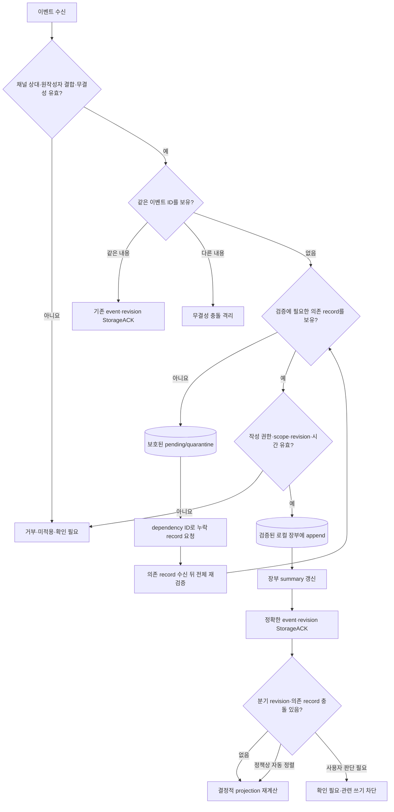
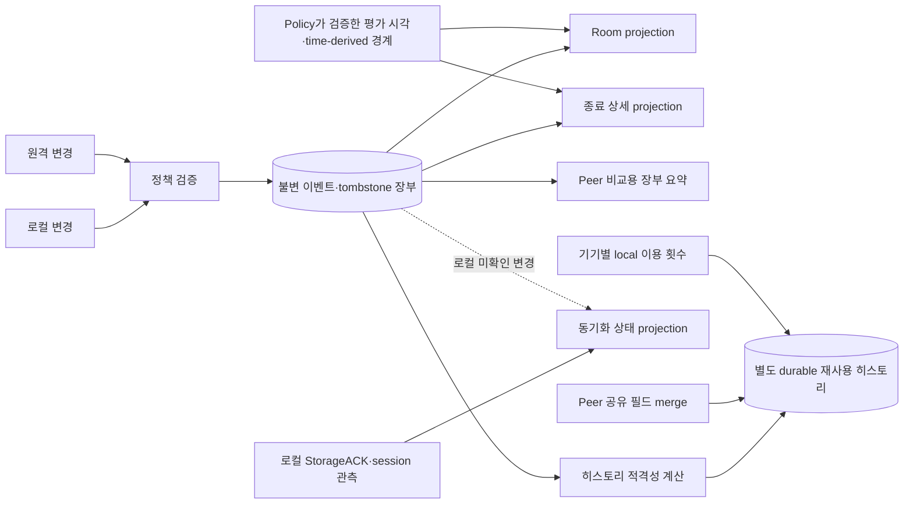
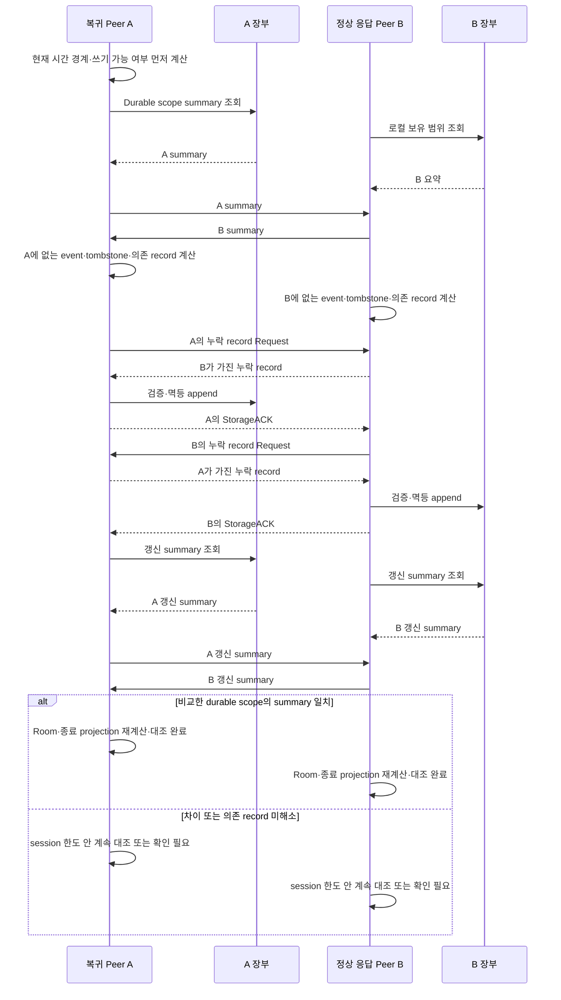

# 04. 복제·정합성·복구

이 문서는 “각 Peer의 장부는 중복·누락·순서 역전·동시 변경을 어떻게
처리하고 sleep·재실행·단절 뒤 어떻게 수렴하는가?”에 답한다. Policy가
정한 충돌 결과를 실행하는 논리 모델을 설명하며 강한 정합성이나 완전 복구를
추가로 약속하지 않는다.

## 한눈에 보기

- 각 Peer는 검증된 불변 이벤트와 tombstone을 로컬 장부에 append하고 화면
  상태를 projection으로 계산한다.
- 이벤트 ID와 revision 검증으로 같은 이벤트의 재수신은 멱등 처리하며,
  동일 ID의 다른 내용은 정상 중복으로 인정하지 않는다.
- 암호학적으로 유효하지만 의존 record가 부족한 event는 invalid와 구분해
  pending/quarantine에 보호하고, 재검증 전에는 장부·summary·ACK에 넣지 않는다.
- anti-entropy는 양쪽 장부 요약과 dependency ID를 비교해 서로 없는 record를
  요청·재검증·append한 뒤 projection을 다시 계산한다.
- 같은 검증 event 집합, Policy reducer와 검증된 평가 시각·time-derived
  경계 입력을 가진 Peer는 Room·종료 상세의 같은 구조화 projection으로
  수렴하는 것을 목표로 하지만, 연결되지 않은 Peer의 미전달 변경과 채팅
  완전 복구를 추측해 강한 정합성·전역 순서를 보장하지 않는다.

## 장부와 projection

로컬 장부는 특정 화면 객체의 현재 값을 덮어쓴 저장소가 아니라, 현재 상태를
재현할 검증 이벤트의 집합이다. 수정은 새 revision, 삭제·무효화는 tombstone
이벤트로 남긴다. 같은 검증 event 집합·Policy reducer와 검증된 평가
시각·time-derived 경계 입력의 결정적 수렴 대상은 Room과 종료 상세 같은
**구조화 운영 projection**이다. 현재 시각에서 파생되는 일일 상태는 장부
event가 아니며, 입력이 다른 두 Peer의 순간 상태가 다를 수 있다.

Pending/quarantine은 원작성자·무결성 envelope는 검증됐지만 권한·revision·
시간 판단에 필요한 dependency가 아직 없는 event를 dependency ID와 함께
보호하는 별도 경계다. 검증된 장부가 아니므로 장부 summary, StorageACK,
구조화 projection이나 재전파의 입력으로 사용하지 않는다. 의존 record를 받은
뒤 현재 Policy로 전체를 다시 검증해 유효한 event만 장부로 승격한다.
Pending envelope는 원 event의 운영일·scope와 `POL-02-R-06`의 최대 14일
로컬 관리 창에 묶어 유한하게 보존한다. Dependency가 끝내 오지 않거나
저장소의 유한 용량 경계를 넘으면 검증 장부로 승격하지 않고 제거하며,
`확인 필요`와 복구 대상을 남긴다.

Projection은 수신 순서에 의존하지 않는다. 모든 Peer가 공유하는 논리 순서,
revision과 결정적 보조 키를 사용하고, 자동 선택이 금지된 충돌은 결과를
만들어 숨기지 않고 `확인 필요`로 남긴다.

동기화 상태는 장부뿐 아니라 각 기기의 StorageACK 수신과 현재 제한 session
관측을 입력으로 받는 **로컬 관측 projection**이다. 같은 event 집합을 가진
Peer라도 StorageACK·접속 관측이 다르면 동기화 상태와 마지막 확인 시각이 다를 수
있다. Sync observation은 관련 event·제한 session·Peer directory의 정책
수명보다 오래 독립적으로 남기지 않으며 retention worker의 정리 대상이다.

재사용 히스토리는 운영 장부와 분리된 durable store다. 장부는 성공 적격성을
계산하는 입력일 뿐이고, Peer와 공유하는 최소 필드를 별도 merge한다. 기기별
local 이용 횟수는 합치지 않으므로 같은 Room event 집합에서도 히스토리
표시값이 완전히 같다고 보장하지 않는다.

## 확정 계약

- 중앙 정본이나 고정 리더 없이 Peer별 장부와 누락 이벤트 교환을 사용한다:
  [POL-02-R-01](../policies/02_replication_consistency_retention.md).
- 즉시 전파와 anti-entropy는 유한한 동기화 세션·의미 있는 trigger 계약을
  따른다: [POL-02-R-02](../policies/02_replication_consistency_retention.md).
- 로컬 저장, 다른 Peer의 StorageACK와 현재 응답 Peer 대조 결과를 구분한다:
  [POL-02-R-03](../policies/02_replication_consistency_retention.md).
- 참여·메뉴의 ACK와 주문 전 누락 방지 조건을 projection에 반영한다:
  [POL-02-R-04](../policies/02_replication_consistency_retention.md).
- 분기 revision, 동시 참여, 순서 이벤트와 tombstone의 충돌 결과는
  [POL-02-R-05](../policies/02_replication_consistency_retention.md)가
  소유한다.
- 보존·채팅·종료 상세·히스토리 재계산은
  [POL-02-R-06](../policies/02_replication_consistency_retention.md)을
  따른다.
- 시계 허용오차가 확정되기 전과 검증할 수 없을 때의 fail-closed 결과는
  [POL-02-R-08](../policies/02_replication_consistency_retention.md)이
  소유한다.

정확한 세션 횟수·시간, 일일 경계와 보존 창은 위 Policy의 입력값이다. 이
문서는 scheduler·retention worker·projection이 해당 값을 소비하는 지점만
설명한다.

## 논리 모델

### 로컬 변경

1. UI가 사용자 의도를 command로 전달한다.
2. 현재 장부 projection과 PRD·Policy로 권한·상태·시간 경계를 검증한다.
3. 유효한 의도를 고유 이벤트 ID와 새 revision을 가진 불변 이벤트로 만든다.
4. 암호화된 로컬 장부에 먼저 append한다.
5. 장부 summary와 로컬 projection을 다시 계산해 `로컬 저장`과 원격 확인을
   구분해 표시한다.
6. 연결된 정상 대상 Peer에 즉시 전파하고 정확한 revision StorageACK를
   수집한다.

로컬 append가 실패하면 이벤트를 생성 완료나 원격 전파 성공으로 표시하지
않는다. 원격 StorageACK 전에 앱이 종료될 수 있으므로 로컬 장부와 outbound
작업의 복구 가능한 연결 방식은 기술 설계에서 함께 정해야 한다.

### 원격 변경

원격 이벤트는 [한눈에 보기](#한눈에-보기)의 순서로 처리한다. 채널 상대·
원작성자 결합과 무결성을 확인하고 event ID·payload를 비교한 뒤, 새로운
event만 의존 record와 권한·scope·revision·시간을 검증한다. Dependency가
없어 아직 판정할 수 없는 event는 invalid로 폐기하지 않고 pending/quarantine에
보호하며, dependency ID로 누락 record를 요청한다.

의존 record를 받은 뒤 전체 검증을 다시 통과한 event는 분기 충돌 여부와
무관하게 append하고 summary를 갱신해 정확한 revision을 StorageACK한 뒤,
해당 scope의 projection과 로컬 동기화 관측을 다시 계산한다. 검증 실패 event는
장부·ACK·projection·재전파에 넣지 않으며, 수신 payload로 화면 객체를 직접
부분 덮어쓰지 않는다.

### 장부 요약

장부 요약은 전체 payload를 매번 보내지 않고 양쪽의 보유 범위를 비교할 수
있는 논리 자료다. 최소한 일일 세션·Room·데이터 종류의 scope를 구분하고,
어떤 이벤트·tombstone이 누락됐는지 후속 request로 식별할 수 있어야 한다.

요약의 hash tree, version vector, set reconciliation 같은 구체 자료구조는
미결정이다. 어떤 방식을 택해도 요약 충돌이나 불완전 응답을 “차이 없음”으로
처리하지 않고, 전체 payload와 같은 민감 정보를 discovery 평문에 노출하지
않는다.

## Anti-entropy와 수렴

Sleep 복귀, 앱 실행, foreground, 네트워크·Peer 변화와 수동 새로고침은 위
교환의 진입점이다. 일일 쓰기 경계를 먼저 계산하므로 오래 잠든 기기가 복귀
직후 이전 쓰기 상태를 잠시 다시 열지 않는다.

Anti-entropy는 양쪽 summary를 대칭으로 교환하고 양쪽에 없는 event,
tombstone과 참여 의존 record를 모두 채운다. Participation request를
원격 command처럼 재실행하지 않고 이미 영속된 request, acceptor ACK evidence,
requester confirmation record만 복제한다. 양쪽이 갱신 summary를 다시
교환해 비교한 durable scope의 일치를 확인해야 대조가 끝난다.

Pending/quarantine의 dependency ID가 가리키는 record도 같은 제한 session에서
요청한다. Dependency가 도착하면 pending event를 처음부터 다시 검증하고,
유효한 경우에만 장부로 append한다. Pending payload 자체는 검증 전까지
상대 summary에 정상 event로 광고하거나 relay하지 않는다.

결정적 수렴 조건은 다음과 같다.

1. 양쪽이 같은 scope의 검증 가능한 event·tombstone과 의존 record를 보유한다.
2. 같은 Policy와 호환되는 reducer 규칙을 실행한다.
3. Policy가 검증한 같은 평가 시각·time-derived 경계 입력을 사용한다.
4. 자동 해결이 금지된 충돌을 같은 `확인 필요` projection으로 남긴다.
5. 시간 유효성을 확인할 수 없는 event를 성공 상태에 포함하지 않는다.

동일한 event가 의존 record보다 먼저 도착해도 pending/quarantine에 남기고,
의존 record가 도착한 뒤 같은 전체 검증 순서를 다시 실행한다. 따라서 최종
검증 event 집합과 projection은 네트워크 도착 순서가 아니라 불변 record와
Policy reducer로 결정된다. Pending 상태 자체는 검증 장부의 일부가 아니며,
세션 한도 안에 의존 record를 확보하지 못하면 `확인 필요`로 남긴다.

이 조건을 충족한 동일 event 집합은 같은 검증 평가 입력에서 Room과 종료
상세 같은 구조화 운영 projection의 같은 결과를 목표로 한다. 서로 다른 현재
시각·clock-validity 관측은 일일 상태 overlay를 다르게 만들 수 있으며 이를
event 집합의 불일치로 취급하지 않는다. 동기화 상태는 로컬
StorageACK·session 관측이 별도 입력이므로 같은 값을 보장하지 않는다.
재사용 히스토리는 별도 durable store와 Peer merge를 사용하고 local 이용
횟수의 차이를 허용하므로 구조화 장부의 결정적 수렴 대상이 아니다.

또한 summary 일치는 **현재 비교한 정상 응답 Peer와 scope**에 한정된다.
연결되지 않은 Peer가 가진 미전달 event의 존재를 증명하지 않으며, 모든
Peer가 동시에 같은 시각에 수렴하는 강한 정합성은 제공하지 않는다.

## StorageACK와 전파 완료

StorageACK는 수신 Peer가 정확한 event·revision을 검증된 영속 저장 경계에
기록했다는 확인이다. 전파 완료는 하나의 Boolean이 아니라 다음 서로 다른
로컬 관측으로 계산한다.

| 관측 | 근거 | 의미 |
|---|---|---|
| 로컬 append 완료 | 자신의 장부 | 현재 기기에 복구 가능한 변경이 있음 |
| 원격 revision StorageACK | 특정 Peer의 StorageACK | 다른 한 복제본의 저장을 확인함 |
| 현재 세션 대조 완료 | 정상 응답 Peer들의 요약 | 현재 발견·응답 범위의 차이를 해소함 |
| 미해소 | timeout, 충돌, invalid data, 불완전 response | 최신성 또는 안전 적용을 확인하지 못함 |

사용자에게 보이는 안정 상태와 주문 완료 차단 여부는
[POL-02-R-03](../policies/02_replication_consistency_retention.md)과
[POL-02-R-04](../policies/02_replication_consistency_retention.md)가 소유한다.
연결되지 않은 Peer가 가진 변경을 없다고 증명하지도 않는다.

## 중복과 멱등성

이벤트 적용 키는 전역적으로 충돌 가능성이 충분히 낮은 이벤트 ID다.

- 같은 ID·같은 내용은 이미 적용한 결과를 바꾸지 않는다.
- 같은 ID·다른 내용은 충돌이나 공격 가능성이므로 격리한다.
- 같은 논리 변경을 다른 ID로 재생성한 경우 revision·대상·작성자 규칙으로
  분기 충돌 여부를 판정한다.
- tombstone 뒤 오래된 원본 이벤트가 재수신돼도 tombstone이 유효한 동안
  projection을 부활시키지 않는다.
- request·response·StorageACK의 재전송은 상관 식별자로 기존 교환과 연결한다.
- 새로운 event의 dependency가 부족하면 같은 event envelope와 dependency ID를
  pending/quarantine에서 멱등하게 보존하고 의존 record 뒤 한 번 더 검증한다.

멱등성은 동일 이벤트의 재적용 방지이며, 서로 다른 동시 이벤트 중 무엇이
업무상 유효한지 자동 결정한다는 뜻이 아니다.

## 참여 의존 기록과 순서 역전

다음 세 durable record의 의존 관계는 **원격 승인 ACK가 필요한 일반 참여
요청**의 확정을 계산한다.

1. Requester가 append한 participation request record
2. Acceptor가 Policy 검증과 영속 저장 뒤 만든 storage·policy ACK evidence
3. Requester가 deadline 전 ACK receipt를 검증하고 append한 confirmation
   record

Request와 ACK evidence만 있으면 pending이며 참여·메뉴 쓰기를 허용하지
않는다. Requester가 confirmation record를 로컬 append한 뒤에만 confirmed
projection을 계산한다. Deadline 뒤 처음 받은 ACK는 영구 실패 outcome이며
늦은 ACK만으로 소급 확정하지 않는다.

반대로 requester가 deadline 전에 confirmation record를 저장했다면 그
record가 다른 Peer에 늦게 도착해도 유효한 늦은 참여다. Remote Peer가
deadline 경과를 관측한 사실은 tombstone이 아니며, valid pre-deadline
confirmation record가 도착한 경우에만 pending 참여를 다시 계산한다.

Anti-entropy는 이 세 record와 failure outcome을 일반 durable event처럼
복제할 뿐 원래 participation request를 다시 실행하지 않는다. Confirmation,
ACK evidence, request가 순서가 뒤집혀 도착하면 의존 record를 모두 확인할
때까지 `확인 필요`를 유지하고 메뉴 event를 허용하지 않는다. 정확한 clock
허용오차, receipt evidence와 wire schema는 `PRD-01-SP-02`,
`PRD-01-SP-03`의 미결정 사항이다.

Room 생성자가 유일한 참여자이고, Room이 한 번도 다른 Peer에 발견·공유되지
않았으며, 알려진 원격 Peer·원격 참여·원격 ACK 이력이 전혀 없는 동안에는
생성자 자동 참여를 로컬 확정하는 엄격한 예외를 적용할 수 있다. 이 예외에는
원격 ACK·confirmation record를 요구하지 않고 메뉴 event를 허용한다. 발견,
공유 또는 원격 이력이 하나라도 생기면 예외는 즉시 소멸하며 이후에는 위
3-record 경로와 주문 전 ACK 점검을 적용한다. 조건과 완료 범위의 정본은
[PRD-01-AC-01](../prd/01_lunchtime_mvp.md)과
[POL-02-R-04](../policies/02_replication_consistency_retention.md)다.

## 순서 역전과 늦은 이벤트

네트워크 수신 순서는 업무 순서가 아니다. Peer는 이벤트의 논리적 순서,
revision과 결정적 보조 키로 projection을 계산한다.

| 상황 | 처리 |
|---|---|
| 더 오래된 revision이 나중에 도착 | 장부에는 보존하되 최신 projection을 되돌리지 않음 |
| 같은 논리 순서의 서로 다른 이벤트 | Policy의 결정적 보조 키를 적용하고 동시 변경을 표시 |
| 정책의 쓰기 경계 전에 유효하게 생성된 이벤트가 늦게 도착 | Policy가 허용한 열람 전용 재계산 경로에 포함 |
| 생성 시각·시계 유효성을 검증할 수 없음 | 성공 projection을 자동 정정하지 않고 `확인 필요` 유지 |
| 채팅이 늦게 도착 | 현재 활성 일일 세션 `11:00 ≤ now < 14:30`에서 원작성자·scope·권한·시간·취소 검증을 통과한 경우만 현재 프로세스 메모리에 best-effort 반영하며 durable 장부·StorageACK·anti-entropy에는 포함하지 않음 |

시계 차이의 정확한 허용오차와 검증 방식은 `PRD-01-SP-03`의 미결정
기술이다. 값이 확정되기 전에도 안전 차단 결과는
[POL-02-R-08](../policies/02_replication_consistency_retention.md)을 따른다.

## 동시 변경과 충돌

아키텍처는 충돌 종류를 감지하고 Policy가 정한 resolution path로 보낸다.
새로운 자동 승자 규칙을 만들지 않는다.

| 충돌 범주 | 감지 근거 | resolution owner |
|---|---|---|
| 동일 사용자·대상의 분기 revision | 동일 base/target에서 서로 다른 revision | `POL-02-R-05`의 사용자 재확정 |
| 한 사용자의 여러 Room 참여 | 같은 운영일·사용자 ID의 동시 유효 참여 | `POL-02-R-05`의 사용자 선택 |
| 생성자 관리 정보 변경 | 생성자·대상의 단조 revision | `POL-02-R-05`의 결정적 정렬 |
| 주문 상태 순서 이벤트 | 참여자 이벤트의 논리 순서·보조 키 | `POL-02-R-05`의 마지막 유효 동작 |
| 취소·철회와 이전 데이터 | tombstone과 대상 이벤트 | `POL-02-R-05`의 무효화 |
| 시간 유효성 불명 | Peer 시계 검증 실패 | `POL-02-R-08`의 fail-closed |

미해결 충돌은 참여·메뉴 누락 위험이 있는 동작과 주문 완료를 차단하는
projection으로 노출한다. 사용자 결정을 이벤트로 기록하면 그 이벤트도
일반 복제·StorageACK·anti-entropy 경로로 전파한다.

## 앱 재실행과 sleep 복귀

### 앱 재실행

1. Keychain과 암호화된 로컬 장부를 연다.
2. 저장된 이벤트로 구조화 projection을 재구성한다.
3. 프로세스 종료로 비워진 채팅 메모리를 영구 장부에서 복원하지 않는다.
4. 현재 네트워크·시간 경계를 판정하고 Peer discovery를 시작한다.
5. 정상 응답 Peer와 장부 대조를 수행한다.
6. 현재 활성 일일 세션 `11:00 ≤ now < 14:30`일 때만 다른 Peer 메모리에
   살아 있고 원작성자·scope·권한·시간·취소 검증을 통과한 채팅을
   best-effort로 다시 받을 수 있다.

14:30 이후 재실행한 프로세스의 채팅 cache는 비어 있으며 Peer 메모리에서
다시 채우지 않는다. 14:30 전에 시작해 계속 실행 중인 같은 프로세스만 현재
메모리에 남은 채팅을 열람 전용으로 보여줄 수 있다. Room이 취소된 뒤에는 새
채팅을 만들 수 없지만, 취소 전에 유효하게 생성된 메시지는 활성 일일 세션
안의 best-effort 재수집에서 검증 후 읽을 수 있다. 정확한 결과는
[PRD-01-FR-04](../prd/01_lunchtime_mvp.md),
[POL-02-R-06](../policies/02_replication_consistency_retention.md),
[POL-04-R-03](../policies/04_surfaces_and_chat.md)과
[POL-04-R-04](../policies/04_surfaces_and_chat.md)를 따른다.

### Sleep 복귀

Sleep 중 실시간 메시지를 받았다고 가정하지 않는다. 먼저 시간 경계를 적용해
쓰기 가능 여부를 계산하고, 그 뒤 장부 요약과 누락 이벤트를 대조한다. 대조가
끝나기 전에는 sleep 전 안정 상태를 그대로 최신이라고 표시하지 않는다.

앱 재실행·sleep 복귀의 정확한 사용자 결과는
[PRD-01-AC-03](../prd/01_lunchtime_mvp.md),
[PRD-01-AC-04](../prd/01_lunchtime_mvp.md)와
[POL-02-R-02](../policies/02_replication_consistency_retention.md)의 입력
계약을 따른다.

## 종료 뒤 재계산과 히스토리

정책의 일일 쓰기 경계 뒤에는 Room을 다시 쓰기 가능하게 만들지 않는다.
보존 중인 유효한 이전 이벤트를 늦게 받으면 종료 상세 projection을 다시
계산할 수 있다. 새로운 정보가 기존 완료 조건을 깨면 성공 히스토리를
그대로 유지하지 않고 Policy가 정한 무효화·복구 결과를 적용한다.

종료 상세와 재사용 히스토리는 같은 객체가 아니다. 종료 상세는 보존 중인
구조화 이벤트의 열람 projection이고, 재사용 히스토리는 성공 조건을 통과한
최소 가게 필드의 별도 projection이다. 정확한 보존·삭제·재계산 결과는
[POL-02-R-06](../policies/02_replication_consistency_retention.md)이 소유한다.

## 실패와 복구

| 실패 | 안전한 결과 | 다음 복구 |
|---|---|---|
| 즉시 전파 StorageACK 누락 | 원격 저장을 추정하지 않고 현재 안정 상태 유지/하향 | 같은 제한 세션의 남은 시도 또는 새 trigger |
| 장부 요약 timeout | 대조 완료로 표시하지 않음 | 새 의미 있는 trigger·수동 새로고침 |
| 일부 이벤트만 수신 | 받은 유효 이벤트만 append, scope 완결성은 미확인 | 다음 anti-entropy에서 차이 재계산 |
| 인증·복호화·무결성 실패 | 이벤트 미적용·정상 응답 대상 제외 | 안전한 Peer와 재대조, 지속 실패 안내 |
| 암호학적으로 유효하지만 dependency 누락 | pending/quarantine에 보호하고 장부·summary·StorageACK·projection·재전파에서 제외 | dependency ID로 제한 요청한 뒤 전체 재검증 |
| 유효한 분기 revision | event·summary·StorageACK를 유지하고 자동 projection만 보류 | 사용자 재확정 event 전파 |
| 참여 의존 record 누락·순서 역전 | pending·확인 필요로 두고 메뉴 쓰기 차단 | 세 record를 anti-entropy로 수집 |
| Deadline 전 저장된 confirmation의 늦은 도착 | 유효한 늦은 참여로 재계산 | 의존 record 검증 뒤 projection 갱신 |
| 시계 유효성 확인 불가 | 시간 의존 쓰기·성공 판정 fail-closed | 시계 점검 뒤 정상 Peer와 재대조 |
| 최종 대조 불완전 | 열람 가능한 정보와 불완전 상태를 함께 표시 | 후속 제한 세션에서 종료 projection 재계산 |
| 14:30 이후 앱 재실행 | 빈 채팅 cache를 Peer 메모리로 복원하지 않음 | 기존 프로세스 메모리만 열람 전용, 다음 활성 일일 세션은 새 cache |
| 모든 채팅 보유 Peer 소실 | 채팅 완전 복구를 실패 약속으로 만들지 않음 | 허용된 메모리 보존 결과 |
| tombstone 만료 뒤 오래된 Peer 복귀 | 종료 scope를 활성화하지 않음, 고아 가능성 허용 | retention·GC 정책 범위에서 정리 |

유한 세션 한도 뒤에는 같은 실패 대상을 타이머만으로 반복하지 않는다. 사용자는
마지막 대조 시각, 확인한 Peer 범위와 미해소 항목을 보고 수동 새로고침을
시작할 수 있다.

## 보장하지 않는 범위

- 선형화 가능성, 강한 정합성, quorum 합의 또는 전역 transaction
- 블록체인·채굴·분산 합의 알고리즘의 구현
- 연결되지 않은 Peer가 가진 미전달 이벤트의 탐지
- 모든 Peer가 동시에 같은 상태를 보는 것
- 채팅의 완전 복구와 모든 Peer의 동일한 전역 순서
- 만료·독립 삭제 뒤 모든 복제본과 고아 데이터의 영구 제거
- 시계 허용오차·검증 방식이 확정되기 전의 시간 유효성 자동 승인
- 정책 한도 밖의 무한 retry·polling 또는 실패 세션의 자동 성공 처리

## 미결정 기술

| 항목 | 논리적으로 필요한 결과 | 확정하지 않은 선택 |
|---|---|---|
| 장부 요약 | 누락 이벤트·tombstone을 식별 가능 | version vector, Merkle 구조, set reconciliation 등 |
| 이벤트 저장 schema | append·revision·scope query·원자성 | DB 엔진, table/record 형식, index |
| pending/quarantine 저장 | 원 event scope의 최대 14일 창과 유한 용량 안에서 envelope·dependency ID를 보호하고 검증 장부와 분리 | 저장 엔진, quota·eviction 방식, dependency index |
| sync observation 저장 | 관련 event·session·Peer 수명에 묶어 유한 보존하고 retention 대상으로 정리 | 저장 엔진, quota·compaction 방식 |
| 충돌 구현 | `POL-02-R-05` 결과를 결정적으로 계산 | CRDT 사용 여부, custom reducer 구조 |
| 논리 순서 | 동일 집합에서 결정적 projection | Lamport/HLC 등 clock 표현 |
| 시계 검증 | `POL-02-R-08`의 안전 차단·복구 | 허용오차 값과 Peer 비교 방식 |
| tombstone·GC | 보존 계약과 종료 scope 비부활 | 안전 삭제 조건, compact·vacuum 방식 |
| outbound 복구 | 로컬 append 뒤 미ACK 전파를 재대조 가능 | 별도 queue, 장부 파생 작업 |
| 대용량 교환 | 제한 세션 안의 완결성 판정 | batching, pagination, backpressure |

위 선택은 `PRD-01-SP-02`, `PRD-01-SP-03`, `PRD-01-SP-05`의 시험과 ADR
없이 확정 기술로 쓰지 않는다.

## 관련 계약과 결정

- PRD: [PRD-01](../prd/01_lunchtime_mvp.md) `PRD-01-FR-01`,
  `PRD-01-FR-02`, `PRD-01-FR-03`, `PRD-01-FR-04`, `PRD-01-FR-05`,
  `PRD-01-FR-06`, `PRD-01-FR-08`, `PRD-01-FR-09`, `PRD-01-FR-10`,
  `PRD-01-FR-11`, `PRD-01-AC-02`, `PRD-01-AC-03`, `PRD-01-AC-04`,
  `PRD-01-AC-05`, `PRD-01-AC-09`, `PRD-01-AC-11`
- Policy: [POL-01](../policies/01_daily_room_lifecycle.md) `POL-01-R-01`,
  `POL-01-R-02`, `POL-01-R-03`, `POL-01-R-04`, `POL-01-R-05`,
  `POL-01-R-07`;
  [POL-02](../policies/02_replication_consistency_retention.md)
  `POL-02-R-01`, `POL-02-R-02`, `POL-02-R-03`, `POL-02-R-04`,
  `POL-02-R-05`, `POL-02-R-06`, `POL-02-R-07`, `POL-02-R-08`;
  [POL-03](../policies/03_security_and_trust.md) `POL-03-R-01`;
  [POL-04](../policies/04_surfaces_and_chat.md) `POL-04-R-03`,
  `POL-04-R-04`
- 결정: [결정 목록](../product-definition/10_decision_backlog.md) `D-03`,
  `D-16`~`D-19`, `D-27`~`D-34`, `D-37`, `D-38`, `D-40`

## 함께 읽기

- 메시지 의미: [03. 통신 프로토콜](./03_communication_protocol.md)
- 저장 수명과 암호화: [05. 저장과 보안](./05_storage_and_security.md)
- 시스템 경계: [01. 시스템 컨텍스트](./01_system_context.md)
- 문서 선택으로 돌아가기: [아키텍처 인덱스](./README.md)
