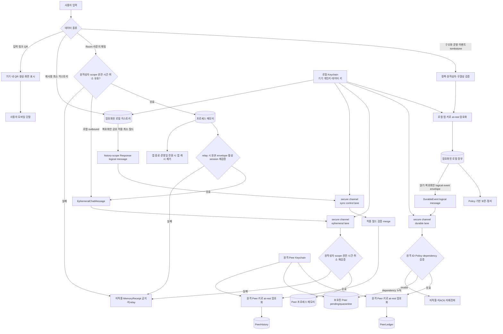
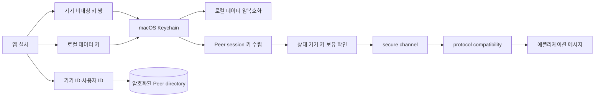
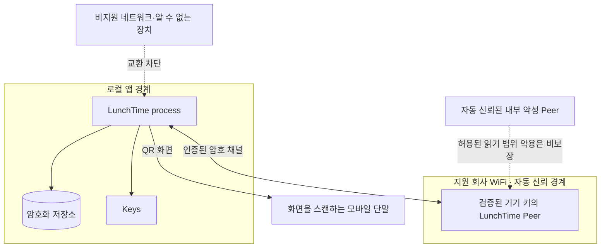

# 05. 저장과 보안

이 문서는 “데이터 종류마다 어디에 저장·복제·삭제되며 전송·저장 경계에서
어떻게 보호하는가?”에 답한다. 암호화 요구와 fail-closed 실행 경로를
설명하되 암호 suite, 키 교환과 저장 엔진은 확정하지 않는다.

## 한눈에 보기

- 로컬 at-rest ciphertext 파일을 그대로 전송하지 않고, 복호화·검증한 logical
  message를 lane별 secure channel로 보낸 뒤 수신 Peer가 검증하고 자기 키로
  다시 at-rest 암호화한다.
- Durable event는 원격 Policy·dependency 검증 뒤 `PeerLedger`로, dependency가
  부족하면 검증 장부와 분리된 pending/quarantine으로 간다.
- 채팅은 송신·수신·relay마다 원작성자·scope·권한·시간·취소 검증을 거쳐
  Peer 프로세스 메모리에만 적용하며 영속 장부·로그·검색 index에 기록하지 않는다.
- 재사용 히스토리는 공유 허용 최소 필드만 `Request·Response`의 history
  scope로 merge하고, 새 protocol lane이나 구조화 운영 장부·채팅 저장 경계로
  정의하지 않는다.
- 인증·무결성·복호화·Keychain 접근이 실패하면 평문 저장이나 비암호
  transport로 낮추지 않고 데이터 적용·교환을 차단하며, 보존·삭제 수치는
  Policy 입력 계약을 따른다.

## 데이터 분류와 저장 경계

| 데이터 종류 | 메모리 | 영속 로컬 저장 | Peer 교환 | 수명·삭제의 정본 |
|---|---|---|---|---|
| 구조화 운영 이벤트·tombstone | projection·작업 중 자료 | 암호화 저장 | 검증된 불변 레코드 | `POL-02-R-06` |
| Dependency pending event | 재검증 작업 | 검증 장부와 분리해 앱 전용 키로 암호화한 pending/quarantine | 정상 event로 광고·relay하지 않고 dependency만 요청 | `POL-02-R-01`, `POL-02-R-03`, `POL-02-R-06` |
| StorageACK·session 관측 | 동기화 상태 projection | 구조화 장부와 분리해 앱 전용 키로 암호화한 local sync-observation store | 운영 event로 재복제하지 않음 | `POL-02-R-03`, `POL-02-R-06`, `POL-02-R-07` |
| Room·라운지 채팅 본문 | 현재 활성 일일 세션 cache | 저장하지 않음 | `11:00 ≤ now < 14:30`의 살아 있는 Peer 메모리 간 best-effort | `POL-02-R-06` |
| 최근 Room 상세 | 이벤트에서 계산한 화면 | 별도 원문 복제보다 이벤트 projection | 보존 중 이벤트로 재구성 | `POL-02-R-06`, `POL-04-R-06` |
| 재사용 최소 히스토리 | 화면 projection | 운영 이벤트와 분리해 암호화 저장 | 공유 허용 최소 필드만 | `POL-02-R-06` |
| Peer directory | 연결 관측 cache | 공개키·ID·닉네임 연결을 암호화 저장 | 닉네임 등 필요한 갱신 | `POL-03-R-02`, `POL-04-R-07` |
| 기기 개인키·로컬 데이터 키 | 암호 연산 중 제한 사용 | Keychain | 개인키·로컬 데이터 키는 전송하지 않음 | `POL-03-R-02`, `POL-03-R-04` |
| 진단 정보 | 제한된 buffer | event ID·status code·duration·anonymized device identifier만 허용 | 제품 데이터 복제 대상 아님 | `POL-02-R-07` |
| QR 입력 문자열 | QR 생성·화면 표시 | Room·히스토리 계약에 따라 보호 저장 | 내부 데이터 없이 정책 허용 범위만 | `POL-03-R-05` |

정확한 보존 기간과 정리 시점은
[POL-02-R-06](../policies/02_replication_consistency_retention.md)이 소유한다.
아키텍처는 보존 worker가 데이터 분류, 일일 scope, tombstone과 히스토리
종류를 구분할 수 있어야 한다는 실행 조건만 둔다. Pending/quarantine은 원
event의 운영일·scope와 최대 14일 창 안에서만 보존하고, sync observation은
관련 event·제한 session·Peer directory의 정책 수명에 묶는다. 두 store는
유한 용량·유한 수명을 가지며, 초과·만료 자료를 검증 장부로 승격하지 않고
`확인 필요`를 남기는 fail-safe 경계를 사용한다. 저장 엔진·schema, 구체
quota·eviction 방식은 미결정이지만 검증 장부와 채팅 memory에서 분리한다.

## 구조화 데이터 저장

### Write path

1. UI command를 현재 projection과 Policy로 검증한다.
2. 고유 이벤트 ID, 작성자·대상·revision과 검증 정보를 가진 이벤트를 만든다.
3. 이벤트를 암호화해 로컬 장부에 원자적으로 append한다.
4. append 성공 뒤 projection과 outbound 복제 대상을 갱신한다.
5. 다른 Peer의 StorageACK와 anti-entropy 결과를 장부와 분리한 보호된
   sync-observation store에 기록한다.

암호화나 append가 실패하면 UI success와 원격 전파를 먼저 확정하지 않는다.
Plaintext 임시 파일을 우회 경로로 만들거나 로그에 payload를 남기지 않는다.

### Read path

1. Keychain에서 앱이 허용된 데이터 키를 가져온다.
2. 저장 레코드를 복호화하고 무결성·schema compatibility를 검증한다.
3. 유효한 이벤트만 장부 집합에 넣는다.
4. Policy reducer로 projection을 재구성한다.
5. 실패 레코드는 조용히 건너뛰어 최신으로 표시하지 않고 데이터 공백과
   복구 필요 상태를 노출한다.

저장 schema migration이나 일부 레코드 손상 복구 방식은 미결정이다. 어떤
방식을 택해도 복호화·무결성 실패 데이터를 정상 장부에 섞지 않는다.

## 채팅 메모리 경계

Room·라운지 채팅 본문은 프로세스 메모리 cache에만 둔다. 채팅 message ID,
scope, 원작성자·기기 결합 검증 정보와 정렬 정보는 메모리 안에서 검증·중복
제거·표시에 사용하고, 본문을 평문 DB, 파일, 검색 index, 진단 log나 crash
metadata에 기록하지 않는다.

로컬 작성, 원격 수신과 재수집 relay는 모두 원작성자·기기 결합, scope,
원작성 시점의 권한·시간·취소 상태를 검증한다. Room의 새 메시지는 원작성자가
현재 참여자이고 Room이 취소되지 않은 활성 일일 세션에만, 라운지 새 메시지는
자동 신뢰 Peer의 활성 일일 세션에만 허용한다. Relay Peer의 채널 인증을
원작성자 권한으로 대신하지 않으며 실패한 message는 메모리에 적용하거나
MemoryReceipt·relay하지 않는다.

Peer에서 다시 받은 채팅도 같은 메모리 경계를 벗어나지 않는다. 앱 종료나
Policy가 정한 운영일 전환에서 앱이 관리하는 cache를 비우며, 재실행 때
영속 저장소에서 채팅을 복원하지 않는다. 현재 활성 일일 세션
`11:00 ≤ now < 14:30`일 때만 살아 있는 Peer가 메모리에 보유하고 위 검증을
통과한 메시지를 best-effort로 다시 받을 수 있다. 채팅 `MemoryReceipt`는
현재 프로세스 수신만 뜻하며 durable StorageACK나 구조화 anti-entropy 완료로
사용하지 않는다.

14:30 이후에는 이미 실행 중인 같은 프로세스가 메모리에 보유한 당일 채팅만
열람 전용으로 보여준다. 14:30 이후 재실행한 프로세스의 cache는 비어 있으며
Peer 메모리에서 다시 채우지 않는다. Room 취소 뒤에는 새 채팅을 만들 수
없지만 취소 전에 유효하게 생성된 message는 활성 일일 세션 안에서 검증 후
best-effort로 재수집할 수 있다. 이 결과는
[PRD-01-FR-04](../prd/01_lunchtime_mvp.md),
[PRD-01-FR-07](../prd/01_lunchtime_mvp.md),
[POL-02-R-06](../policies/02_replication_consistency_retention.md),
[POL-04-R-03](../policies/04_surfaces_and_chat.md)과
[POL-04-R-04](../policies/04_surfaces_and_chat.md)를 따른다.

앱은 macOS의 memory compression, swap과 system diagnostic dump를 완전히
통제할 수 없다. 따라서 “메모리 전용”을 OS 전체에서 평문 흔적이 절대 남지
않는다는 보장이나 종단간 삭제 표현으로 확대하지 않는다.

## 재사용 히스토리와 종료 상세

종료 상세는 보존 중인 구조화 이벤트에서 계산한 열람 projection이고,
재사용 히스토리는 새 Room의 기본값에 필요한 최소 가게 레코드다. 둘은
저장·삭제·복제 단위를 분리한다.

- 종료 상세는 채팅 본문을 포함하지 않는다.
- 불완전 종료는 확인 가능한 상세를 보여도 성공 히스토리 source가 되지
  않는다.
- 유효한 늦은 이벤트를 받으면 종료 projection과 히스토리 적격성을 Policy로
  다시 계산한다.
- Peer와 합치는 히스토리 필드와 기기 로컬에만 남는 값은 구분한다.
- 로컬 삭제와 tombstone 전파가 다른 모든 Peer의 영구 삭제를 증명하지 않는다.

필드, 동일 가게 key와 보존 결과의 정확한 규칙은
[PRD-01-FR-08](../prd/01_lunchtime_mvp.md)과
[POL-02-R-06](../policies/02_replication_consistency_retention.md)을
입력 계약으로 참조한다.

## 키와 기기 식별

첫 실행은 설치 단위의 비대칭 기기 키 쌍, 안정적인 기기 ID와 사용자 ID를
만든다. 개인키와 로컬 데이터 암호화 키는 데이터 파일·설정·소스와 분리해
Keychain에 둔다. 공개키·기기 ID·사용자 ID·닉네임의 검증된 연결만 Peer
directory에 보호 저장한다.

기기 키의 구체 알고리즘, session key 교환, rotation, Keychain 접근 제어와
재설치·기기 분실 처리는 `PRD-01-SP-04`의 미결정 기술이다. 식별 정보를
잃은 재설치를 새 사용자로 취급하는 제품 결과와 닉네임 비권한성은
[POL-03-R-02](../policies/03_security_and_trust.md)이 소유한다.

## 전송 보호

전송 순서는 `raw transport → 기기 인증·secure channel → protocol
compatibility → application messages`다. Discovery 단계는 닉네임, 안정적
기기 ID, 사용자 ID와 public-key fingerprint가 없는 불투명 최소 hint와
endpoint만 다루고, raw transport 연결 생명주기는
[02. Peer 네트워크와 전송](./02_peer_network_and_transport.md)이 소유한다.

이 문서는 raw transport 위에 만드는 secure channel이 다음 보안을
제공해야 한다는 계약을 소유한다.

- 상대 기기 키 보유를 확인한다.
- 기밀성과 메시지 무결성을 제공한다.
- replay를 검출·거부할 수 있다.
- 인증·복호화 실패 payload를 적용·재전파하지 않는다.

Secure channel을 만든 다음
[03. 통신 프로토콜](./03_communication_protocol.md)이 channel 위에서
protocol compatibility를 확인한다. 그 결과가 성공한 뒤에만 Room·메뉴·채팅,
입력 링크와 장부 summary 같은 application message를 보낸다.

전송하는 것은 로컬 저장 파일의 at-rest ciphertext가 아니라 저장소에서
복호화한 뒤 원작성자·무결성과 Policy를 검증한 logical message다. Logical
message는 lane별 secure channel에서 다시 전송 보호를 받고, 수신 Peer는
자기 검증을 통과한 durable event와 history-scope `Response`의 허용 field만
자기 데이터 키로 at-rest 암호화한다. Ephemeral chat은 같은 채널 보호를
사용해도 수신 Peer의 프로세스 메모리 경계를 넘어 영속 저장하지 않는다.

암호 suite와 transport 결합 방식은 미결정이지만 평문 HTTP, 평문 WebSocket,
서명 없는 사용자 데이터 broadcast로 요구를 낮출 수 없다. 순방향 안전성을
포함한 정확한 보안 검토 조건은
[POL-03-R-03](../policies/03_security_and_trust.md)과
[POL-03-R-07](../policies/03_security_and_trust.md)을 따른다.

## 저장 보호

구조화 운영 이벤트, tombstone, Peer directory와 재사용 히스토리는 앱
전용 키로 암호화한다. 키는 저장 파일과 분리하고 다음 보조 경로에도 평문이
남지 않게 한다.

- 앱·진단 log와 crash metadata
- Spotlight나 다른 검색 index
- 알림 본문 preview
- 임시 파일과 export 가능한 설정
- 소스 코드·fixture·문서

사용자가 메뉴 요약 복사를 명시적으로 실행하면 system clipboard에 평문이
남을 수 있다. 앱은 이 경계를 사전에 알리고, 다른 앱이 쓴 clipboard를
임의 삭제하거나 자동 만료를 보장하지 않는다. 정확한 계약은
[POL-03-R-04](../policies/03_security_and_trust.md)가 소유한다.

## 진단 정보 allowlist

개발·진단 log와 crash용 진단 field에는 다음 네 종류만 허용한다.

- event ID
- status code
- duration
- anonymized device identifier

메뉴·옵션, 채팅, 입력 링크와 닉네임뿐 아니라 raw user ID, stable device ID,
public-key fingerprint도 진단 정보에 기록하지 않는다. Anonymized device
identifier를 만드는 방식, session 간 상관 가능 범위와 재식별 위험 제한은
`PRD-01-SP-05`의 미결정 기술이며, 그 전에는 raw identifier를 편의상
대체값으로 사용하지 않는다. 이 allowlist는
[POL-02-R-07](../policies/02_replication_consistency_retention.md)의 입력
계약을 실행한다.

## 신뢰 경계와 위협 대응

| 위협 | 실행 통제 | 남는 한계 |
|---|---|---|
| 네트워크 수동 도청 | 인증된 암호 채널 | 자동 신뢰 Peer가 받은 평문 악용 |
| 전송 중 변조·replay | 무결성·replay 검증, 실패 이벤트 미적용 | 구현 결함은 보안 검토 필요 |
| 로컬 데이터 파일 탈취 | at-rest encryption, Keychain 키 분리 | 잠금 해제 session·실행 중 memory |
| 비지원 네트워크 Peer | 지원 경계 판정 실패 시 교환 차단 | 경계 판정 방식 자체는 검증 대기 |
| 위조 닉네임 | 권한은 닉네임 대신 사용자·기기 ID 사용 | 강한 사람 신원 인증은 아님 |
| 민감 log·index 유출 | 진단 allowlist와 payload·raw 식별자 기록 금지 | OS 진단 동작 전체를 통제하지 못함 |
| 화면·clipboard·QR 촬영 | 명시적 동작과 경계 안내 | 사용자의 외부 반출·물리 촬영 |
| 로컬 삭제 뒤 원격 잔존 | tombstone·정책 보존 worker | 모든 Peer의 즉시·영구 삭제 불가 |

자동 신뢰된 내부 악성 Peer 위협을 수용한다는 것은 인증·암호화를 생략한다는
뜻이 아니다. Transport 도청·변조와 비지원 장치를 막되, 정책상 읽을 수 있는
데이터를 정상 수신한 Peer가 악용하는 상황까지 방어하지 않는 경계다.

## 삭제와 garbage collection

Retention worker는 Policy가 소유한 데이터 종류·보존 창을 입력받아 로컬
이벤트와 tombstone을 정리한다. 채팅 cache 삭제, 구조화 운영 데이터 만료,
pending/quarantine 만료, sync observation의 관련 event·session·Peer 수명
종료, Peer 목록 정리와 최소 히스토리 삭제는 서로 다른 작업이다.

로컬 삭제가 성공해도 다음을 전역적으로 보장하지 않는다.

- 현재 오프라인인 Peer가 같은 복제본을 삭제했음
- tombstone을 받지 못한 오래된 Peer가 다시 데이터를 제시하지 않음
- OS backup·swap·diagnostic dump의 모든 흔적이 사라짐
- 만료 뒤 비핵심 고아 데이터가 절대 다시 나타나지 않음

Garbage collection은 종료된 일일 scope를 활성화하지 않고, tombstone을
너무 일찍 없애 projection을 부활시키지 않아야 한다. 정확한 TTL 기준 시각,
tombstone 수명과 GC 안전 조건은 `PRD-01-SP-05`의 미결정 기술이다.

## 확정 계약

- 기기 키·사용자 ID·Keychain 저장과 닉네임 분리:
  [POL-03-R-02](../policies/03_security_and_trust.md)
- 모든 Peer 애플리케이션 데이터의 인증된 암호 전송:
  [POL-03-R-03](../policies/03_security_and_trust.md)
- 구조화 데이터·Peer 목록·히스토리의 저장 암호화:
  [POL-03-R-04](../policies/03_security_and_trust.md)
- QR의 로컬 생성과 외부 경계:
  [POL-03-R-05](../policies/03_security_and_trust.md)
- 내부 악성 Peer, OS memory·화면·전역 삭제 비보장:
  [POL-03-R-06](../policies/03_security_and_trust.md)
- 데이터 종류별 보존·삭제·재계산:
  [POL-02-R-06](../policies/02_replication_consistency_retention.md)

## 논리 모델

저장·보안 구현은 다음 인터페이스 경계를 유지한다.

| 경계 | 성공 결과 | 실패 결과 |
|---|---|---|
| `KeyProvider` | Keychain의 허용된 기기·데이터 키 handle | 평문 fallback 없이 안전 차단 |
| `EncryptedLedger` | 원자적 encrypted append·validated read | 이벤트 미생성/격리와 데이터 공백 표시 |
| `PendingEventStore` | dependency ID와 원본 envelope를 검증 장부와 분리해 보호 | 정상 summary·StorageACK·projection·relay에서 제외 |
| `SyncObservationStore` | StorageACK·session 결과를 장부와 분리해 보호 | 운영 event나 결정적 Room projection으로 승격하지 않음 |
| `EphemeralChatPolicyGate` | 송신·수신·relay의 원작성자·scope·권한·시간·취소 검증 | message 미적용·MemoryReceipt 금지·미relay |
| `EphemeralChatStore` | 현재 process lifetime의 message cache | 영속 저장으로 자동 승격하지 않음 |
| `HistoryStore` | 공유 허용 최소 필드와 기기 local 값을 분리한 encrypted merge | 운영 장부·채팅·기기별 이용 횟수 혼합 금지 |
| `PeerDirectory` | 보호된 기기·사용자·공개키·닉네임 연결 | 신원·권한 추정 금지 |
| `SecureChannel` | 채널 상대가 인증되고 기밀성·전송 무결성이 보호된 message 경로 | 애플리케이션 검증을 대신하지 않으며 실패 시 payload 미적용·연결 종료 |
| `RetentionWorker` | Policy 분류별 로컬 정리 | 전역 삭제 완료로 표시하지 않음 |
| `RedactedDiagnostics` | event ID·status code·duration·anonymized device identifier만 기록 | raw user/device ID·public-key fingerprint와 민감 payload 기록 금지 |

이 이름은 구현 class를 확정하는 API가 아니라 테스트 가능한 책임 분리다.

## 실패와 복구

| 실패 | 안전한 처리 | 복구·관측 |
|---|---|---|
| Keychain 접근 실패 | 암복호화·Peer 인증 중단, 평문 fallback 금지 | 키 접근 문제와 `확인 필요` 표시 |
| 로컬 암호화 실패 | append·성공 UI·원격 전파 금지 | 저장소 진단 뒤 다시 명시적 동작 |
| 레코드 복호화·무결성 실패 | projection·재전파에서 제외 | 데이터 공백 표시, 정상 Peer와 제한 재대조 |
| 저장 schema 호환 실패 | 알 수 없는 레코드를 정상으로 해석하지 않음 | migration/호환성 경로 또는 안전 중단 |
| Peer 인증·복호화 실패 | 정상 응답 Peer 제외, payload 미적용 | 새 의미 있는 연결에서 재검증 |
| Durable event dependency 누락 | 보호 pending/quarantine에 두고 장부·summary·StorageACK·projection·relay에서 제외 | dependency ID로 제한 요청한 뒤 전체 재검증 |
| 채팅 원작성자·scope·권한·시간·취소 검증 실패 | 메모리 미적용·MemoryReceipt 금지·미relay | 활성 일일 세션의 유효한 원본 envelope만 재수집 |
| 활성 일일 세션의 채팅 cache 소실 | 영속 복원 성공으로 가장하지 않음 | `11:00 ≤ now < 14:30`에 살아 있는 Peer memory에서 검증 후 best-effort 재수신 |
| 14:30 이후 재실행 | 빈 채팅 cache를 Peer memory로 다시 채우지 않음 | 기존 프로세스 memory만 열람 전용, 다음 활성 일일 세션은 새 cache |
| retention 정리 중단 | 삭제 완료로 표시하지 않음 | 다음 안전한 worker 실행에서 재평가 |
| 로컬 히스토리 삭제 뒤 원격 재등장 | 전역 삭제를 약속하지 않음 | Policy tombstone·고아 처리 결과 표시 |
| QR 렌더 실패 | 외부 주문 결과로 추론하지 않음 | QR을 표시할 수 없음을 알림 |

키 분실·재설치 시 기존 암호화 데이터의 사용자 복구 UI나 destructive reset
절차는 아직 확정하지 않았다. 근거 없는 복구를 약속하거나 자동 데이터 삭제를
수행하지 않고 `PRD-01-SP-04` 결과로 별도 설계한다.

## 보장하지 않는 범위

- 특정 암호 알고리즘·suite, key exchange·rotation 방식
- “종단간 암호화”라는 제품 표현이 뜻하는 모든 조건의 충족
- 자동 신뢰된 내부 악성 Peer의 허용 범위 내 평문 악용 방지
- 잠금 해제 Mac, 탈취된 로그인 session이나 실행 중 악성 software 방어
- macOS memory compression·swap·diagnostic dump의 완전 통제
- 화면 촬영, 명시적 clipboard 복사와 QR 촬영 뒤 외부 반출 방지
- 모든 Peer 복제본·backup·고아 데이터의 즉시·영구 삭제
- 손실된 Keychain 키로 기존 데이터를 항상 복구하는 것

## 미결정 기술

| 항목 | 필요한 검증 | 관련 스파이크 |
|---|---|---|
| 전송 암호 protocol·suite | 기밀성·무결성·replay·순방향 안전성 검토 | `PRD-01-SP-04` |
| 기기 키 교환·회전 | 첫 연결, 재연결, 교체·분실·재설치 시험 | `PRD-01-SP-04` |
| 로컬 at-rest encryption | 파일 탈취, Keychain ACL, corruption·migration 시험 | `PRD-01-SP-04`, `PRD-01-SP-05` |
| 저장 엔진·schema | 원자 append, scope query, migration, backpressure | `PRD-01-SP-02`, `PRD-01-SP-05` |
| pending·sync observation 저장 | 검증 장부와의 분리, 암호화, 확정된 유한 수명 안의 quota·eviction·dependency query 구현 | `PRD-01-SP-02`, `PRD-01-SP-05` |
| Keychain 장애 복구 UX | 키 손실·접근 거부에서 비파괴 진단·reset 정책 | `PRD-01-SP-04` |
| retention·tombstone·GC | 기준 시각, 안전 삭제·고아 재등장 시험 | `PRD-01-SP-05` |
| 채팅 origin·memory 검증 | 원작성자-기기 결합, 권한·시간·취소 causal proof, relay 재검증, 정상·비정상 종료와 저장 흔적 | `PRD-01-SP-02`, `PRD-01-SP-04`, `PRD-01-SP-05` |
| redacted diagnostics | allowlist 검사와 device identifier anonymization 방식 | `PRD-01-SP-04`, `PRD-01-SP-05` |

## 관련 계약과 결정

- PRD: [PRD-01](../prd/01_lunchtime_mvp.md) `PRD-01-FR-04`,
  `PRD-01-FR-07`, `PRD-01-FR-08`, `PRD-01-FR-09`, `PRD-01-FR-10`,
  `PRD-01-FR-11`, `PRD-01-FR-12`,
  `PRD-01-AC-04`, `PRD-01-AC-06`, `PRD-01-AC-07`, `PRD-01-AC-08`
- Policy: [POL-02](../policies/02_replication_consistency_retention.md)
  `POL-02-R-01`, `POL-02-R-03`, `POL-02-R-06`, `POL-02-R-07`;
  [POL-03](../policies/03_security_and_trust.md) `POL-03-R-01`,
  `POL-03-R-02`, `POL-03-R-03`, `POL-03-R-04`, `POL-03-R-05`,
  `POL-03-R-06`, `POL-03-R-07`;
  [POL-04](../policies/04_surfaces_and_chat.md) `POL-04-R-03`,
  `POL-04-R-04`, `POL-04-R-05`, `POL-04-R-06`, `POL-04-R-07`
- 결정: [결정 목록](../product-definition/10_decision_backlog.md) `D-19`,
  `D-20`, `D-28`, `D-34`~`D-36`, `D-42`~`D-44`

## 함께 읽기

- 시스템·신뢰 경계: [01. 시스템 컨텍스트](./01_system_context.md)
- 연결과 암호 채널 수립: [02. Peer 네트워크와 전송](./02_peer_network_and_transport.md)
- 장부 수렴과 GC 전제: [04. 복제·정합성·복구](./04_replication_consistency_and_recovery.md)
- 문서 선택으로 돌아가기: [아키텍처 인덱스](./README.md)
