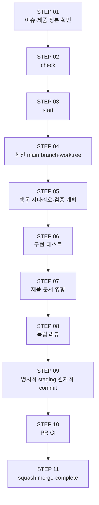

# LunchTime 개발 하네스 가이드

이 문서는 Claude Code와 Codex가 대화 이력 없이도 같은 요청을 같은 계약으로
분류하고, GitHub 이슈 확인부터 병합 뒤 완료 처리까지 연결하는 단일
orchestrator 인덱스다. 세부 명령과 필드 형식은 연결된 Skill·템플릿이
소유하며, 이 문서는 요청 라우팅, 단계와 중단 판단만 연결한다.

## 한눈에 보기

- 각 단계는 앞 단계의 완료 증거를 입력으로 받으며, 실패·불일치를 숨긴 채
  다음 단계로 넘어가지 않는다.
- 이슈의 `완료 조건`이 행동 시나리오를 소유하고, PR의 기존 `검증` 표가 테스트,
  독립 리뷰와 CI 증거를 전달한다.
- 제품 결과와 규칙은 [PRD](../prd/README.md)와
  [Policy](../policies/README.md)가 소유한다. 하네스는 이를 구현·검증하는
  절차만 정한다.
- GitHub 상태 변경과 자동 반복은 각 Skill이 정한 유한한 경계 안에서만
  수행한다.

## 요청 라우팅

| 요청 유형 | 첫 정본 입력 | 실행 Skill·소유자 | 종료·인계 지점 |
|---|---|---|---|
| 새 이슈 작성·감사 | 승인된 PRD·Policy·결정, 이슈 양식 | [`run-github-work-item`](../../.agents/skills/run-github-work-item/SKILL.md)의 이슈 작성·`create` | 검증된 이슈·Project 등록 상태를 인계한다. 이 on-demand 이슈 생성은 아래 11단계 밖의 준비 작업이다. |
| 기존 이슈 구현·재개 | 이슈 본문, 정본 ID, 기본 의존 관계, 허용·금지 경로 | `run-github-work-item check`·`start` 뒤 STEP 01~09 소유 Skill | 검증된 commit을 PR 단계에 인계한다. |
| 제품 문서 작성·변경 | 승인된 결정, PRD·Policy 인덱스, 관련 이슈 경로 계약 | [`update-product-docs`](../../.agents/skills/update-product-docs/SKILL.md) | 문서 영향 판정과 planned ID 계약 결과를 구현 단계에 인계한다. |
| commit 작성 | 이슈 범위, raw diff, 테스트·리뷰·문서 영향 증거 | [`commit-work-item`](../../.agents/skills/commit-work-item/SKILL.md) | push하지 않은 원자적 commit을 인계한다. |
| PR 생성·갱신만 | clean issue branch, PR 본문 계약, 검증 증거 | [`open-pull-request`](../../.agents/skills/open-pull-request/SKILL.md)의 PR 모드 | PR 생성·갱신과 재조회에서 멈추고 병합하지 않는다. |
| 작업 완료·병합 | Ready PR, 현재 head·CI·review snapshot, 명시적인 완료 요청 | [`open-pull-request`](../../.agents/skills/open-pull-request/SKILL.md)의 finalize 모드와 [`run-github-work-item`](../../.agents/skills/run-github-work-item/SKILL.md)의 `complete` | 한 번의 squash merge·원격 branch 삭제·완료 전이 뒤 안전한 로컬 정리 결과를 인계한다. |
| 실패·부분 응답 복구 | 마지막 성공 단계와 현재 GitHub·Git 상태 | 쓰기를 소유한 Skill의 재조회·복구 계약 | 현재 상태를 재조회하고 중복 쓰기 없이 새로 실행할 한 단계만 인계한다. |

## 규칙 소유와 링크

한 규칙에는 세부 정본 소유자를 하나만 둔다. 이 인덱스와 루트 문서는 규칙을
복사하지 않고 소유 정본을 링크하며, 소유 정본이 바뀌면 링크와 validator를
같은 변경에서 맞춘다.

| 규칙 | 단일 소유 정본 | 이 인덱스의 역할 |
|---|---|---|
| 사용자 결과·수용 동작 | [PRD](../prd/README.md) | STEP 입력으로 연결 |
| 상태·권한·실패·복구·보존·보안 | [Policy](../policies/README.md) | STEP 입력으로 연결 |
| PRD·Policy planned ID 수명주기 | [update-product-docs](../../.agents/skills/update-product-docs/SKILL.md) | 새 ID 요청을 단일 owner로 라우팅 |
| 작업 범위·경로·행동 시나리오·검증 계획 | [run-github-work-item 이슈 계약](../../.agents/skills/run-github-work-item/references/issue-contract.md) | 이슈 양식·제품 추적 적용 경계·구현·리뷰 입력을 단일 계약으로 라우팅 |
| 이슈·Project 상태 전이·재조회·복구 | [run-github-work-item](../../.agents/skills/run-github-work-item/SKILL.md) | 이슈·Project 요청을 단일 owner로 라우팅 |
| PR 쓰기·exact-head finalize·원격·로컬 정리 | [open-pull-request](../../.agents/skills/open-pull-request/SKILL.md) | PR 수명주기 요청을 단일 owner로 라우팅 |
| PR의 고정 필드 | [PR 템플릿](../../.github/PULL_REQUEST_TEMPLATE.md)과 [PR 본문 계약](../../.agents/skills/open-pull-request/references/pr-body-contract.md) | STEP 10·11 입력으로 연결 |
| CI의 결정적 증거 | [하네스 workflow](../../.github/workflows/validate-harness.yml)의 `validate`, [앱 workflow](../../.github/workflows/app-ci.yml)의 `app-test`, [PR metadata workflow](../../.github/workflows/validate-pr-metadata.yml)의 `pr-metadata` | strict required `validate`·`app-test`·`pr-metadata`를 각 독립 workflow의 결정적 결론으로 연결 |

## 구성요소와 책임

| 구성요소 | 이 흐름에서 맡는 책임 |
|---|---|
| [`run-github-work-item`](../../.agents/skills/run-github-work-item/SKILL.md) | on-demand 이슈 작성·`create`, 이슈 계약 확인, `check`·`start`, 병합 뒤 `complete`, Project·레이블·담당자 상태 일치 |
| [`update-product-docs`](../../.agents/skills/update-product-docs/SKILL.md) | 구현 전후 PRD·Policy·제품 정의 영향과 정본 충돌 확인 |
| [`commit-work-item`](../../.agents/skills/commit-work-item/SKILL.md) | 범위·검증·문서 영향을 대조한 explicit staging과 원자적 commit |
| [`open-pull-request`](../../.agents/skills/open-pull-request/SKILL.md) | 전체 branch 검증, push, Draft·Ready PR 생성·재확인, 명시적 완료 요청의 exact-head finalize |
| [MVP 작업 이슈 양식](../../.github/ISSUE_TEMPLATE/work-item.yml) | 11개 기존 본문 구역과 행동 시나리오를 담는 `완료 조건` |
| [PR 템플릿](../../.github/PULL_REQUEST_TEMPLATE.md) | 다섯 H2 안에서 변경 결과·추적성·검증·문서 영향 인계 |
| [MVP Project](https://github.com/orgs/GoCalendar/projects/1) · [보드](https://github.com/orgs/GoCalendar/projects/1/views/2) | `Todo`·`In Progress`·`Done` 작업 상태 관측 |
| [`validate` workflow](../../.github/workflows/validate-harness.yml) | PR의 `opened`·`synchronize`·`reopened`와 `main` push에서 문서·계약·회귀 테스트·commit·diff 결과를 required check `validate`로 결속 |
| [`app-test` workflow](../../.github/workflows/app-ci.yml) | PR과 `main`에서 macOS 앱의 Debug build·UI 제외 test·Release build를 required check `app-test`로 검증 |
| [`pr-metadata` workflow](../../.github/workflows/validate-pr-metadata.yml) | `opened`·`synchronize`·`reopened`·`edited`·`ready_for_review` event마다 live 제목·본문·Draft·head·base를 다시 읽어 required check `pr-metadata`로 검증 |

명령 인자, 이슈 본문 구조와 GitHub 전이의 상세 정본은 각 Skill과 참조 계약에
둔다. 이 가이드와 세부 계약이 어긋나면 한쪽을 우회하지 말고 같은 변경에서
정렬한다.

## STEP 01. 이슈와 제품 정본 확인

- **목적:** 구현할 결과 하나와 그 결과를 지배하는 제품·경로 계약을 대화 이력 없이 복원한다.

- **핵심 입력:** GitHub 이슈의 11개 본문 구역, [PRD](../prd/README.md), [Policy](../policies/README.md), 결정 이력, 기본 의존 관계, 변경 허용·금지 경로와 `update-product-docs`의 planned ID 계약이다.

- **완료 조건:** 목표·범위·적용 가능한 기존·planned 추적 ID 또는 tooling-only 비적용 근거·선행 작업·행동 중심 `완료 조건`·검증·문서 영향을 설명할 수 있고, 누락된 제품 결정이 없다.

- **대표 실패·중단 조건:** 이슈 계약이 불완전하거나 정본끼리 충돌하거나 제품 결정을 추측해야 하거나 planned ID 계약을 충족하지 못하거나 작업 경로가 다른 진행 중 이슈와 겹친다.

## STEP 02. `check`로 준비 상태 검증

- **목적:** GitHub 상태를 바꾸기 전에 이슈가 실제로 선점 가능한지 읽기 전용으로 확인한다.

- **핵심 입력:** 이슈 번호와 [`run-github-work-item`의 `check`](../../.agents/skills/run-github-work-item/SKILL.md), 담당자·레이블·기본 의존 관계, Project 관리 이슈의 Project 상태·동시 작업 한도다.

- **완료 조건:** `check`가 열린 `Todo`, 담당자 없음과 선행 이슈 종료를 확인하고, Project 관리 이슈인 경우에만 Project `Todo`와 진입 한도 충족도 확인한다.

- **대표 실패·중단 조건:** 이슈가 이미 선점됐거나 차단됐거나 레이블 또는 해당되는 Project 상태가 어긋나거나 GitHub 관계를 신뢰성 있게 읽을 수 없다.

## STEP 03. `start`로 작업 선점

- **목적:** 구현 직전에 이슈·담당자·레이블, 해당되는 Project와 작업 branch 소유권을 하나의 검증된 시작 상태로 맞춘다.

- **핵심 입력:** `work/issue-<번호>-<slug>` branch 이름, 안정적인 agent marker와 [`run-github-work-item`의 `start`](../../.agents/skills/run-github-work-item/SKILL.md)다.

- **완료 조건:** 승리한 선점 표식, 현재 담당자, `status:in-progress`와 기록된 branch가 일치하고, Project 관리 이슈인 경우에만 Project `In Progress`도 재조회에서 일치한다.

- **대표 실패·중단 조건:** 경합에서 다른 선점이 승리했거나 branch 형식·권한·상태 전이·사후 검증 중 하나라도 실패한다.

## STEP 04. 최신 `main`에서 branch와 worktree 생성

- **목적:** 성공한 선점이 기록한 정확한 branch를 최신 `origin/main` 위의 독립 작업 공간에 둔다.

- **핵심 입력:** 갱신한 `origin/main`, `start`에 기록된 branch, 저장소 [개발 협약](../../CONTRIBUTING.md)과 독립 worktree 경로다.

- **완료 조건:** 현재 branch가 선점 기록과 같고 base가 최신 `origin/main`이며, 작업자별 worktree가 분리되고 시작 전 사용자 변경을 침범하지 않는다.

- **대표 실패·중단 조건:** `start` 전 branch 생성, 오래된 base, branch 불일치, 공유 worktree·branch, 기존 사용자 변경과 안전하게 분리할 수 없는 상태다.

## STEP 05. 행동 시나리오와 검증 계획 작성

- **목적:** 구현 전에 관찰 가능한 성공·실패·복구 결과와 그 증거를 확정한다.

- **핵심 입력:** 이슈의 `완료 조건`, 적용 가능한 PRD·Policy ID 또는 `run-github-work-item` 이슈 계약이 허용한 tooling-only 비적용 근거와 [BDD/ATDD 테스트 표준](./02_testing_standard.md)의 시나리오 축·테스트 계층이다.

- **완료 조건:** 적용 가능한 happy·error·recovery 시나리오가 조건·행동·결과와 추적 ID 또는 tooling-only 비적용 근거로 연결되고, 각 시나리오의 결정적 검증 방법이 이슈 `검증` 계획과 일치한다.

- **대표 실패·중단 조건:** 구현 세부사항만 검사하거나 error·recovery path가 없거나 실제 시간·무한 재시도·flaky rerun에 의존하거나 제품 결과를 이슈에서 새로 정한다.

## STEP 06. 구현과 테스트

- **목적:** 실패하는 행동 증거에서 시작해 이슈 범위 안의 최소 구현으로 계약을 만족시킨다.

- **핵심 입력:** STEP 05의 시나리오, 허용 경로, 기존 코드·테스트 관례, fake clock·fake transport와 결정적 fixture다.

- **완료 조건:** 관련 수용·행동 테스트와 happy·error·recovery 경로가 통과하고 리팩터링 뒤에도 전체 관련 회귀 테스트가 재현 가능하게 통과한다.

- **대표 실패·중단 조건:** 금지 경로 침범, 정본과 다른 동작, 테스트 순서·공유 상태 의존, 임의 sleep, 실패를 숨기는 반복 실행 또는 범위를 넓혀야만 통과하는 구현이다.

## STEP 07. 제품 문서 영향 확인

- **목적:** 구현이 사용자 결과나 상태·권한·실패·복구·보존·보안 계약을 바꾸는지 commit 전에 판정한다.

- **핵심 입력:** 전체 raw diff, 이슈의 기존·planned 추적 ID와 변경 허용 경로, [`update-product-docs`](../../.agents/skills/update-product-docs/SKILL.md)의 문서 영향·planned ID 계약이다.

- **완료 조건:** 영향을 받는 정본과 planned ID 계약을 같은 변경에서 충족했거나, 제품 동작이 바뀌지 않는 구체적인 근거를 기록했다.

- **대표 실패·중단 조건:** 정본 갱신이 허용 경로 밖이거나 Ready 전에도 planned ID 계약을 충족하지 못했거나 정본 충돌·미결정 제품 선택이 있거나 validator 통과만으로 의미상 정확성을 단정한다.

## STEP 08. 독립 리뷰

- **목적:** 작성자의 자기 검토와 분리된 읽기 전용 관점에서 요구사항 누락·회귀·위험을 찾는다.

- **핵심 입력:** 원본 이슈·PRD·Policy, answer injection이 없는 review prompt, frozen raw diff, 실제 테스트 결과와 아래 위험 등급별 reviewer 구성이다.

- **완료 조건:** P0~P2 결과가 `file:line`, 재현·근거와 필요한 수정으로 기록되고, 수정했다면 writer와 분리된 reviewer가 새 snapshot을 별도 pass로 다시 확인한다.

- **대표 실패·중단 조건:** 작성 컨텍스트의 “문제 없음”을 승인으로 사용하거나 reviewer가 수정하거나 기대 답을 미리 주입하거나 세 번째 pass 뒤에도 P0/P1이 남는다.

## STEP 09. 명시적 staging과 원자적 commit

- **목적:** 검증된 이슈 결과 하나만 index에 올리고 독립적으로 되돌릴 수 있는 commit으로 남긴다.

- **핵심 입력:** 검토한 개별 경로, 전체 diff·테스트·독립 리뷰·문서 영향 증거와 [`commit-work-item`](../../.agents/skills/commit-work-item/SKILL.md) 계약이다.

- **완료 조건:** `git add -- <개별 파일>...`로만 staging하고 cached diff·공백·메시지·신원·hook을 검증한 원자적 commit 하나가 만들어지며 push하지 않는다.

- **대표 실패·중단 조건:** 기존 staged 변경, 범위 밖·사용자 소유 파일, `git add .`·`git add -A`·glob·directory staging, 실패한 hook, 자동 amend·reset이 필요하다.

## STEP 10. PR 작성과 CI

- **목적:** 전체 branch 결과를 다음 작업자가 재구성할 수 있는 Draft 또는 Ready PR로 게시하고 원격 게이트를 확인하며 PR 생성·갱신만 요청한 경우 여기서 멈춘다.

- **핵심 입력:** commit된 clean branch, [PR 템플릿](../../.github/PULL_REQUEST_TEMPLATE.md), [`open-pull-request`](../../.agents/skills/open-pull-request/SKILL.md), base `main`, required check `validate`·`app-test`·`pr-metadata`다.

- **완료 조건:** `Closes #N`, 다섯 H2, 실제 추적·문서 영향·검증 증거와 정확히 하나의 `독립 리뷰` 행을 가진 PR이 생성·재조회되고, Ready이면 리뷰 증거가 현재 head를 가리키며 모든 행과 최신 `main` 기준 required check `validate`·`app-test`·`pr-metadata`가 통과한다.

- **대표 실패·중단 조건:** dirty·뒤처진 branch, 중복 PR, 미실행·실패·결정 필요를 숨긴 Ready, stale review snapshot, CI 실패 또는 생성 뒤 재조회 불일치이며 PR-only 요청을 임의로 finalize하지 않는다.

## STEP 11. Squash merge와 `complete`

- **목적:** 사용자가 완료·병합 또는 end-to-end 진행을 명시했을 때 검증된 PR 결과 하나를 `main`에 남기고 원격·이슈·Project·로컬 상태를 병합 사실과 일치시킨다.

- **핵심 입력:** base `main`인 Ready PR, 현재 head와 일치하는 독립 리뷰, 통과한 필수 CI, 해결된 리뷰 대화, 검증된 제목·본문·`Closes #N`, same-repository 경계와 명시적인 완료 요청, [`open-pull-request` finalize](../../.agents/skills/open-pull-request/SKILL.md), [`run-github-work-item complete`](../../.agents/skills/run-github-work-item/SKILL.md)다.

- **완료 조건:** `open-pull-request`가 검증된 current head를 exact-head squash merge로 한 번만 병합하고 원격 branch 결과를 재조회한 뒤 `run-github-work-item complete`가 이슈·Project 상태를 맞춘다. 이어서 `open-pull-request`가 정확히 식별한 clean 로컬 대상만 정리하며 `.omc`와 사용자 소유 상태를 보존한다. 이미 확인된 병합·완료·정리 단계는 반복하지 않고 현재 상태에서 안전하게 재개한다.

- **대표 실패·중단 조건:** Draft, stale·불일치 head 또는 독립 리뷰, 실패·대기 CI, 미해결 리뷰 대화, base·source·제목·본문·종료 참조 불일치, fork·저장소 신원 불명확, 병합 응답 불명확 상태의 재시도, 병합 전 `complete`, dirty·사용자 소유 잔여물, 원격·로컬 대상 신원 drift 또는 추측한 worktree·branch 정리다. 세부 판정과 복구 상태는 `open-pull-request`의 단일 상세 계약을 따른다.

## 독립 리뷰 표준

### 역할과 입력

- **작성·수정자:** 구현과 수정만 수행하며 같은 작성 컨텍스트의 승인 판정을
  최종 근거로 사용하지 않는다.
- **Reviewer:** 작성 컨텍스트와 분리된 읽기 전용 역할이다. 파일·GitHub 상태를
  수정하지 않고 발견 사항만 보고한다.
- **Approver:** 새 snapshot의 요구사항 충족 여부를 판정하며 해당 snapshot을
  작성·수정한 역할과 분리한다.
- Reviewer에게 원본 요구사항, 관련 정본, raw diff, 재실행 가능한 테스트 명령과
  실제 결과를 제공한다. 요약만 제공하거나 “문제 없음으로 결론 내라” 같은 예상
  답을 주입하지 않는다.

### 발견 사항과 반복 한도

발견 사항은 `P0`·`P1`·`P2`, `file:line`, 재현 절차 또는 직접 근거, 필요한
수정을 포함한다. 발견 사항이 없으면 검토한 snapshot과 관점을 명시해
`P0~P2 없음`으로 보고한다.

Writer가 수정한 뒤에는 이전 판정을 재사용하지 않고 frozen raw diff와 새 테스트
결과로 별도 review pass를 실행한다. 같은 reviewer가 다시 보더라도 계속 읽기
전용이어야 하며 writer 역할을 겸하지 않는다. 최초 검토를 포함해 최대 3 pass만
허용하고, 세 번째 pass 뒤에도 P0/P1이 남으면 무한 review-fix를 중단해 blocker로
보고한다.

| 변경 위험 | 최소 독립 리뷰 |
|---|---|
| 낮음 — 단순 문서·국소 변경 | 분리된 reviewer 1명 |
| 중간 — 계약·validator·workflow 변경 | 서로 다른 관점의 reviewer 2명 |
| 높음 — 분산 통신·정합성·보안 | 필요한 전문 관점별 reviewer를 병렬 배치 |

PR의 `검증` 표에는 `독립 리뷰` 대상 행을 정확히 하나 두고 관점, pass, 결과와
근거를 남긴다. Ready PR은 이 행이 `통과`여야 한다. GitHub의 형식적 승인 수가
0이어도 이 증거를 생략하지 않는다.

현재 흐름은 기존 네 Skill과 분리된 일반 reviewer 역할로 충분하다. 독립적이고
반복 재사용할 새 책임이 확인되기 전에는 리뷰 전용 Skill을 추가하지 않는다.
