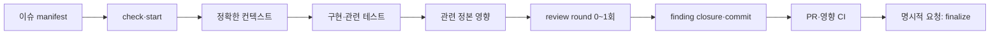

# LunchTime 개발 하네스 가이드

이 문서는 요청을 최소 입력과 단일 Skill owner에 연결하는 orchestrator
인덱스입니다. 명령, 필드 형식과 안전 규칙은 연결된 계약이 소유하며 이
문서에서 복제하지 않습니다.

## 한눈에 보기

기본 원칙은 “모든 것을 읽고 모두 검증”이 아니라 “이슈가 가리킨 것을 읽고
영향받은 것을 검증”입니다.

## 요청 라우팅

| 요청 | 첫 입력 | Skill owner | 기본 종료 |
|---|---|---|---|
| 이슈 작성·감사 | 승인된 제품 결과와 정확한 정본 파일·ID | [`run-github-work-item`](../../.agents/skills/run-github-work-item/SKILL.md)의 `create`·`validate-body` | 검증된 이슈 |
| 이슈 구현·재개 | 이슈 본문과 GitHub 상태 | `run-github-work-item check`·`start` | 구현 가능한 독립 worktree |
| PRD·Policy 작성 | 승인된 결정과 변경할 정확한 정본 | [`update-product-docs`](../../.agents/skills/update-product-docs/SKILL.md) | 변경 문서와 영향 판정 |
| 구현 | 이슈의 허용 경로, 완료 조건, 정확한 정본 참조 | 코드 owner와 [테스트 표준](./02_testing_standard.md) | 관련 테스트를 통과한 결과 |
| commit | 이슈 범위, 전체 diff, 관련 테스트·문서 영향·review 결과 | [`commit-work-item`](../../.agents/skills/commit-work-item/SKILL.md) | push하지 않은 원자적 commit |
| PR 생성·갱신 | clean issue branch와 실제 검증 결과 | [`open-pull-request`](../../.agents/skills/open-pull-request/SKILL.md)의 PR 모드 | 재조회된 Draft 또는 Ready PR |
| 완료·병합 | Ready PR과 명시적 완료 요청 | `open-pull-request` finalize, 이후 `run-github-work-item complete` | squash merge와 안전한 정리 |
| 부분 실패 복구 | 마지막 성공 단계와 현재 상태 | 쓰기를 수행한 Skill | 중복 쓰기 없이 다음 한 단계 |

현재 요청에 해당하지 않는 Skill과 참조 계약은 읽지 않습니다.

## 작업 컨텍스트 manifest

이슈에서 다음 입력을 추출합니다.

- 관찰 가능한 목표와 완료 조건
- 적용되는 정확한 PRD·Policy ID, 파일과 관련 절
- 필요한 경우 정확한 Architecture 파일
- 변경 허용·금지 경로
- 직접 관련 코드와 인접 테스트
- 선택할 테스트 case·suite·target과 확대 조건
- 문서 영향과 리뷰 위험도

다음은 기본 입력이 아닙니다.

- `README.md` 전체
- PRD·Policy·Architecture 전체 인덱스와 모든 하위 문서
- 관련 없는 Skill과 복구 계약
- `docs/product-definition/**`

`docs/product-definition/**`은 역사 archive이므로 일반 구현·리뷰·영향
판정에서 읽거나 수정하지 않습니다. 역사 조사나 archive 자체 유지보수를
명시한 이슈만 정확한 대상 파일을 예외로 지정할 수 있습니다.

추가 컨텍스트는 구현 중 실제 질문이 생겼을 때만 읽습니다. 먼저 현재 코드의
정의·참조와 인접 테스트를 찾고, 그래도 제품 의미가 필요하면 이슈의 직접
정본 링크를 따라갑니다. 필요한 정본이 없거나 서로 충돌하면 탐색을 넓혀
추측하지 않고 blocker로 보고합니다.

## 실행 단계

### 1. 준비와 선점

`run-github-work-item check`로 열린 이슈, 선행 관계와 소유 가능 상태를
확인하고, 구현 직전에 `start`를 실행합니다. 성공한 선점 기록과 같은 짧은
브랜치를 최신 `origin/main` 기준 독립 worktree에서 사용합니다.

### 2. 행동과 테스트 계획

이슈 완료 조건에서 필요한 happy·error·recovery 결과를 고릅니다. 모든 가능한
축을 복제하지 않고 이번 변경에 관련된 축만 선택합니다. 테스트 범위는
[테스트 표준](./02_testing_standard.md)의
`direct case/suite → affected target → subsystem → global` 순서로 정합니다.

### 3. 구현

허용 경로 안에서 실패하는 직접 테스트와 최소 구현을 반복합니다. 관련
case·suite만 빠르게 재실행하며 전체 test, 모든 validator와 모든 CI job을
로컬에서 선제 실행하지 않습니다.

### 4. 문서 영향

전체 diff를 보되 이슈가 지정한 PRD·Policy·Architecture에 실제 의미 변화가
있는지만 확인합니다. 필요하면 같은 이슈가 소유한 정본을 함께 수정합니다.
범위 밖 정본 변경이나 새 제품 결정이 필요하면 현재 이슈를 넓히지 않고
후속 제품 계약 이슈로 차단합니다.

### 5. 한 번의 review round

[AGENTS.md의 독립 리뷰 계약](../../AGENTS.md#독립-리뷰)에 따라 낮은 위험은
reviewer 0명, 일반은 1명, 고위험은 같은 round에서 최대 2명을 사용합니다.
Reviewer는 수정하지 않습니다. 메인 세션이 같은 round의 finding을 합쳐
수정하고 직접 관련 diff와 테스트로 해소를 확인하며 re-review하지 않습니다.

Review 뒤 범위·요구사항·아키텍처·신뢰 경계를 넓혀야 하는 finding은 현재
작업의 수정 항목이 아니라 blocker 또는 후속 이슈입니다.

### 6. Commit과 PR

`commit-work-item`이 검토한 개별 파일만 stage하고 index·공백·메시지·신원·
hook과 commit tree를 확인합니다. 제품 문서·이슈·PR validator는 해당 artifact를
바꾼 경우나 해당 단계에서만 실행합니다.

`open-pull-request`는 commit을 push하고 실제 테스트 선택 이유와 결과를
기록한 PR을 만든 뒤 재조회합니다. CI도 같은 영향 범위를 사용하며 전체
테스트는 영향 불명 또는 명시적 release 검증일 때만 선택합니다.

### 7. 완료

PR 생성·갱신 요청은 여기서 멈춥니다. 명시적 완료·병합 요청에서만 current
head, required CI, 해결된 review 대화, base·제목·본문·종료 참조와
same-repository 경계를 확인해 exact-head squash merge를 한 번 수행합니다.
그 뒤 `complete`와 안전한 로컬 정리를 진행합니다.

## 규칙 소유

| 규칙 | 단일 소유자 |
|---|---|
| 컨텍스트 최소화·리뷰 round·공통 안전 | [AGENTS.md](../../AGENTS.md) |
| 사람용 branch·commit·PR 흐름 | [CONTRIBUTING.md](../../CONTRIBUTING.md) |
| 이슈 본문·상태 전이 | [run-github-work-item](../../.agents/skills/run-github-work-item/SKILL.md) |
| PRD·Policy와 planned ID | [update-product-docs](../../.agents/skills/update-product-docs/SKILL.md) |
| 테스트 범위 선택 | [BDD/ATDD 테스트 표준](./02_testing_standard.md) |
| 로컬·CI 검증 선택 | [검증 게이트와 CI 흐름](./03_validation_ci_flow.md) |
| staging·commit | [commit-work-item 계약](../../.agents/skills/commit-work-item/references/commit-contract.md) |
| PR·merge·원격 및 로컬 정리 | [open-pull-request](../../.agents/skills/open-pull-request/SKILL.md) |

실패한 외부 쓰기를 반복하지 않습니다. 현재 상태를 재조회하고 해당 쓰기를
소유한 Skill의 조건부 복구 절만 읽은 뒤 남은 한 단계만 수행합니다.
