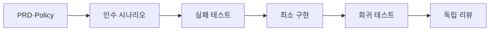

# LunchTime BDD/ATDD 테스트 표준

이 문서는 PRD·Policy의 관찰 가능한 결과를 구현 전 시나리오와 결정적 테스트로
연결하는 표준이다. 테스트는 구현 확인용 부속물이 아니라 실행 가능한 기획
문서, error·recovery path의 증거와 빠른 병렬 작업의 회귀 안전망이다.

## 한눈에 보기

- 구현 전에 사용자가 관찰할 조건·행동·결과와 추적 ID를 먼저 정한다.
- 실패 테스트는 계약이 아직 충족되지 않음을 재현하고, 구현은 그 계약을
  만족하는 최소 범위에서 시작한다.
- happy path만이 아니라 error·recovery path를 같은 회귀 안전망에 둔다.
- 독립 리뷰는 테스트가 구현 세부사항에 고정되거나 비결정적 실패를 숨기지
  않는지 별도 컨텍스트에서 확인한다.

## 테스트 자산의 역할

테스트와 시나리오는 다음 네 역할을 함께 가진다.

1. **실행 가능한 기획 문서:** 이슈 `완료 조건`과 PRD·Policy 결과를 사람이
   읽을 수 있는 행동으로 나타낸다.
2. **행동 계약:** 정상 결과뿐 아니라 잘못된 입력, 권한 거부, 실패와 복구 뒤의
   관찰 가능한 결과를 고정한다.
3. **회귀 안전망:** 서로 다른 작업자가 병렬로 수정해도 이미 승인된 결과가
   조용히 사라지지 않게 한다.
4. **추적 근거:** `PRD-NN-FR-NN`, `PRD-NN-AC-NN`, `POL-NN-R-NN`과 실제
   테스트 이름·파일·결과를 연결한다.

제품 기능과 수용 결과는 [PRD](../prd/README.md), 상태·권한·실패·복구 규칙은
[Policy](../policies/README.md)가 소유한다. 이 표준과 테스트 예시는 제품
규칙을 새로 정하지 않는다.

## 행동 시나리오 작성 원칙

- 사용자·업무 행동은 `Given / When / Then` 또는 `조건 / 행동 / 결과`로
  표현한다. 저장 class나 private method 같은 구현 구조보다 외부에서 관찰할
  상태·출력·차단·복구 결과를 쓴다.
- 구현 전에 적용 가능한 happy·error·recovery 시나리오를 먼저 정하고 이슈의
  `완료 조건`과 `검증`에서 다시 찾을 수 있게 한다.
- 시나리오와 테스트에 관련 요구사항·수용 기준·Policy ID를 연결한다. 한 테스트에
  모든 ID를 몰아넣지 말고 실제로 검증하는 계약만 기록한다.
- 테스트 이름과 arrange/act/assert 구조만 읽어도 어떤 조건에서 어떤 행동이
  어떤 결과를 만드는지 알 수 있어야 한다.
- 실패 메시지는 값 비교 실패만 출력하지 않고 깨진 행동 계약과 관련 ID를
  식별할 수 있어야 한다.
- 모든 단위 테스트에 Gherkin 문법을 강제하지 않는다. 도메인 예시와 인수
  시나리오에는 행동 문법을 쓰고, 작은 단위 테스트는 명확한 이름과 구조로 같은
  의도를 전달해도 된다.

## 기능별 시나리오 축

모든 기능에 열 축을 기계적으로 복제하지 않는다. 관련 PRD·Policy와 위험을
기준으로 필요한 축을 선택하고, 제외한 중요한 축은 근거를 검증 계획에 남긴다.

| 시나리오 축 | 확인할 질문 |
|---|---|
| 정상 흐름 | 유효한 입력과 상태에서 약속한 결과가 나타나는가? |
| 입력·상태 경계 | 최소·최대·마감 전후와 허용하지 않는 상태를 구분하는가? |
| 권한과 소유권 | 허용된 주체만 읽기·쓰기·상태 전이를 수행하는가? |
| 중복과 멱등성 | 같은 요청·이벤트를 다시 받아도 결과가 중복되지 않는가? |
| 순서 역전 | 늦거나 뒤집힌 입력을 네트워크 도착 순서대로 오적용하지 않는가? |
| 동시성·충돌 | 동시에 유효한 변경을 Policy의 충돌 결과로 보내는가? |
| 네트워크 단절과 복귀 | 단절 중 누락을 추측하지 않고 복귀 뒤 제한된 대조로 복구하는가? |
| timeout과 제한된 재시도 | 횟수·시간 한도 뒤 멈추고 관찰 가능한 실패를 남기는가? |
| 저장·보존·삭제 | 재실행·만료·삭제 뒤 데이터 종류별 보존 계약을 지키는가? |
| 보안과 신뢰 경계 | 인증·무결성·지원 네트워크 경계 실패 데이터를 적용하지 않는가? |

## 권장 BDD/ATDD 흐름

1. **PRD·Policy에서 인수 시나리오 도출:** 이슈 `완료 조건`에 조건·행동·결과,
   추적 ID와 필요한 happy·error·recovery path를 기록한다.
2. **실패하는 수용·행동 테스트 작성:** 구현 전 같은 결과가 아직 충족되지
   않음을 재현하며, 잘못된 이유로 실패하지 않는지 확인한다.
3. **최소 구현:** 실패 원인을 해소하는 이슈 범위 안의 가장 작은 변경을 만든다.
4. **Happy·error·recovery 통과:** 선택한 시나리오 축의 관찰 가능한 결과를
   모두 확인한다.
5. **리팩터링:** 행동 계약을 유지한 채 중복과 구조를 개선하고 관련 테스트를
   다시 실행한다.
6. **독립 테스트 리뷰:** 작성자와 분리된 읽기 전용 reviewer가 시나리오,
   raw diff와 실제 결과를 검토한다.
7. **전체 회귀 테스트:** 영향 범위의 빠른 테스트부터 저장소 필수 게이트까지
   실행하고 PR에 재실행 가능한 증거를 남긴다.

상세 작업 순서와 review-fix 한도는
[개발 하네스 가이드](./01_harness_guide.md)를 따른다.

## 결정적 테스트 규칙

| 위험한 방식 | 사용하는 방식 |
|---|---|
| 임의 `sleep` 뒤 결과 추측 | 주입 가능한 fake clock·scheduler를 명시적으로 진행 |
| 실제 Peer·네트워크의 우연한 타이밍 | fake transport와 전달·단절·순서 제어 |
| 매 실행마다 달라지는 무작위 데이터 | 고정 seed 또는 의미가 드러나는 결정적 fixture |
| 종료 조건 없는 polling·retry | 테스트와 제품 계약 모두에 횟수·시간 상한 설정 |
| 테스트 실행 순서와 전역 공유 상태 의존 | 테스트별 상태 생성·정리와 독립 실행 |
| 실패할 때까지 또는 통과할 때까지 재실행 | 단일 실행으로 재현하고 원인을 수정 |

네트워크·동시성 테스트는 메시지 전달, 중복, 순서, disconnect·reconnect와
timeout을 test harness가 직접 제어해야 한다. 실제 시간과 스케줄러 우연에
맡기지 않으며, 실패한 flaky test를 단순 rerun으로 green 처리하지 않는다.
재현 조건과 seed·fixture를 보존하고 원인을 수정한 새 실행만 증거로 사용한다.

## 테스트 계층과 우선순위

MVP에서는 다음 순서로 빠르고 결정적인 피드백을 우선한다.

| 계층 | 주된 책임 |
|---|---|
| 도메인·상태 전이 단위 테스트 | reducer, 권한, 경계와 충돌 결과를 작은 입력으로 검증 |
| 구성요소 테스트 | 저장소·동기화 조정자·화면 모델 같은 한 경계의 입출력 검증 |
| 결정적 통합 테스트 | fake clock·transport·저장소를 묶어 복구와 상호작용 검증 |
| validator·계약 테스트 | 문서·이슈·commit·PR·workflow interface 회귀 방어 |

단위 테스트 수가 많다는 이유만으로 사용자 흐름을 검증했다고 간주하지 않는다.
반대로 모든 동작을 느린 통합 테스트 하나에 몰아넣지 않고, 실패 원인을 좁힐 수
있는 가장 낮은 계층과 경계 간 결과가 필요한 계층을 함께 사용한다.

## LunchTime 예시 시나리오

아래 예시는 테스트 설계 시작점이며, 정확한 제품 결과는 연결된 정본을 따른다.

| 사례 | 조건 | 행동 | 관찰할 결과와 정본 |
|---|---|---|---|
| Sleep 중 놓친 참여·메뉴 복구 | 한 Mac이 잠든 동안 다른 Peer가 유효한 참여·메뉴 변경을 보유 | Mac을 깨우고 자동 대조 trigger를 실행 | 보유 Peer가 있으면 누락분을 복구하고, 제한 안에 해소하지 못하면 성공으로 가장하지 않는다. [PRD-01-AC-03](../prd/01_lunchtime_mvp.md), [POL-02-R-02](../policies/02_replication_consistency_retention.md) |
| 동일 이벤트 중복 수신 | 같은 이벤트 ID와 내용을 이미 한 번 처리 | 같은 event를 다시 전달 | 업무 효과를 중복 적용하지 않고 같은 검증 집합의 projection을 유지한다. [POL-02-R-01](../policies/02_replication_consistency_retention.md), [복제 아키텍처](../architecture/04_replication_consistency_and_recovery.md) |
| 주문 마감 뒤 늦은 참여 | 참여 요청의 마감 전 ACK 수신 여부가 서로 다른 fixture를 준비 | 확정 record가 마감 뒤 다른 Peer에 도착 | 기한 내 ACK가 확인된 참여와 받지 못한 요청을 구분하고 시계 검증 실패는 안전 차단한다. [PRD-01-AC-09](../prd/01_lunchtime_mvp.md), [POL-02-R-04](../policies/02_replication_consistency_retention.md), [POL-02-R-08](../policies/02_replication_consistency_retention.md) |
| 주문 완료 전 ACK 누락 | 다인 Room의 최신 참여·메뉴 리비전 중 확인되지 않은 항목이 있음 | 주문 완료를 요청 | 누락 위험을 표시하고 완료·요약 복사를 허용하지 않는다. [PRD-01-AC-02](../prd/01_lunchtime_mvp.md), [POL-02-R-04](../policies/02_replication_consistency_retention.md) |
| 신뢰 경계 밖·검증 실패 Peer | 지원 네트워크 밖이거나 인증·무결성 검증에 실패한 응답을 준비 | 운영 데이터를 수신 | 데이터를 적용·재전파하거나 정상 응답 Peer로 세지 않는다. [PRD-01-AC-08](../prd/01_lunchtime_mvp.md), [POL-02-R-03](../policies/02_replication_consistency_retention.md), [POL-03-R-01](../policies/03_security_and_trust.md), [POL-03-R-03](../policies/03_security_and_trust.md) |

정본의 여러 규칙을 한 링크 표기로 묶었더라도 테스트 이름과 주석에는 실제로
검증하는 개별 ID를 명시한다.

## 독립 테스트 리뷰

Reviewer에게 원본 요구사항·추적 ID, 시나리오 목록, 테스트와 구현의 raw diff,
실제 테스트 결과를 제공한다. 예상 결론이나 작성자가 의도한 답은 주입하지
않는다. Reviewer는 읽기 전용으로 다음을 확인한다.

- 관련 있는 시나리오 축과 happy·error·recovery path가 빠지지 않았는가?
- 구현 세부사항이 아니라 외부에서 관찰 가능한 결과를 검증하는가?
- fake clock·fake transport·fixture와 종료 한도가 결정적인가?
- 테스트끼리 순서·공유 상태에 의존하지 않는가?
- 실패 메시지와 이름이 깨진 행동 계약을 식별하는가?
- Gherkin을 모든 작은 단위 테스트에 형식적으로 강제하지 않는가?
- flaky 실패를 rerun으로 숨기지 않고 재현·수정했는가?

발견 사항은 `P0`~`P2`, `file:line`, 재현 근거와 필요한 수정으로 보고한다.
수정 뒤에는 새 snapshot을 별도 pass로 다시 검토하며, 역할 분리·위험별 reviewer
수와 최대 3 pass 규칙은
[하네스 가이드의 독립 리뷰 표준](./01_harness_guide.md)을 따른다.

## E2E 트레이드오프

MVP 개발 단계에서는 E2E를 필수 게이트로 두지 않는다. 도메인·상태 전이 단위,
구성요소, 결정적 통합, validator·계약 테스트를 먼저 안정화한다.

E2E는 다음 조건을 모두 검토할 수 있게 된 뒤 별도 이슈에서 도입 여부를
평가한다.

1. MVP 핵심 기능이 완료됐다.
2. 주요 사용자 흐름이 안정됐다.
3. UI와 통신 interface가 안정됐다.
4. CI 실행 시간과 유지 비용을 측정·평가할 수 있다.

현재 작업에서 E2E framework를 선택하거나 빈 테스트 디렉터리·fixture·scaffold를
미리 만들지 않는다. E2E 미도입을 이유로 관찰 가능한 수용 시나리오와 결정적
통합 테스트를 생략하지도 않는다.
