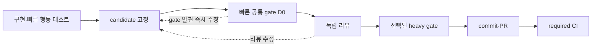

# LunchTime 검증 게이트와 CI 흐름

이 문서는 구현 중 반복 검증을 줄이고, 고정된 candidate에 필요한 검증만
실행하도록 로컬 gate와 원격 CI의 흐름을 연결하는 사람용 안내다. 정확한 명령,
evidence JSON schema와 경로 분류 규칙은 연결된 계약과 workflow가 소유한다.

## 한눈에 보기

- 구현 중에는 이슈별 빠른 행동 테스트만 반복하고 고정 gate 전체는 미룬다.
- candidate를 고정한 뒤 D0와 독립 리뷰를 거쳐 선택된 heavy gate만 실행한다.
- tree와 입력이 같으면 통과 증거를 유지하고, 바뀐 입력의 gate만 다시 실행한다.
- 원격 required check는 항상 통과하되 비대상 고비용 job은 할당하지 않는다.

## 문서 경계와 정본

| 질문 | 보는 곳 |
|---|---|
| 전체 11단계 | [개발 하네스 가이드](./01_harness_guide.md) |
| 독립 리뷰 역할·입력·수정 chain·반복 한도 | [독립 리뷰 표준](./01_harness_guide.md#독립-리뷰-표준) |
| 로컬 gate·증거 재사용·원격 CI의 사람용 흐름 | 이 문서 |
| 정확한 gate 명령·evidence schema·재진입 판정 | [commit-work-item 계약](../../.agents/skills/commit-work-item/references/commit-contract.md) |
| 원격 job·event·required check의 실제 구성 | [validate workflow](../../.github/workflows/validate-harness.yml), [app-test workflow](../../.github/workflows/app-ci.yml), [pr-metadata workflow](../../.github/workflows/validate-pr-metadata.yml) |
| 경로별 회귀군 선택 규칙 | [canonical classifier](../../.github/workflows/validate-harness-paths.mjs) |

이 문서는 위 정본의 명령이나 schema를 복제하지 않는다. 흐름과 실제 계약이
어긋나면 우회하거나 문서만 맞추지 않고 owner와 validator를 함께 갱신한다.

## 변경 경로별 CI 회귀 선택

`validate` workflow는 작은 Markdown·Skill 설명 변경에는 구문·계약·diff 같은
빠른 공통 gate만 실행한다. owner의 `scripts/` 변경은 해당 owner 회귀군만
추가하고, 서로 다른 owner 변경은 필요한 회귀군의 합집합을 병렬 실행한다.
경로별 입력 manifest는 로컬 helper와 원격 workflow가 함께 소비하는
`validate-harness-paths.mjs`의 canonical classifier 규칙이다.

workflow·경로 classifier·공유 하네스 계약 변경, 확정할 수 없는 base/head diff,
`schedule`과 `workflow_dispatch`는 네 회귀군을 모두 선택해 fail-closed한다.
evidence helper 자체 변경은 로컬에서 기존 증거 전체를 invalidated 처리하되
canonical current selection과의 교집합인 `commit-pr-regression`만 실행하고
나머지는 drop한다. 증거를 재사용하지 않는 원격 CI도 owning
`commit-pr-regression`만 실행한다.
required check `validate`는 classifier가 선택한 회귀군(`true`)의 `success`와
선택하지 않은 회귀군(`false`)의 `skipped`를 각각 요구하므로, 생략과 실패를
혼동하지 않는다.

`app-test` workflow도 docs·tooling-only 변경에는 macOS runner를 할당하지
않는다. 앱·workflow·classifier 변경, 확정할 수 없는 diff,
`schedule`·`workflow_dispatch`는 macOS 검증을 선택해 fail-closed하고,
required `app-test`가 classifier 선택값과 `app-build`의 실제
`success`·`skipped` 결과를 결속한다. PR `edited`는 base 변경을 놓치지 않도록
현재 base/head를 다시 분류하되 docs·tooling-only면 macOS를 계속 생략한다.
같은 head의 Draft→Ready 전환은 앱 내용을 바꾸지 않으므로 앱 workflow를 다시
실행하지 않으며, Ready 상태 자체는 `pr-metadata`가 검증한다.

## 최종 snapshot 검증 순서

| 순서 | 단계 | 필수 계약 |
|---|---|---|
| 1 | 빠른 행동 검증 | 구현 중에는 이슈별 행동 테스트만 빠르게 반복하며 저장소 고정 게이트 전체를 실행하지 않는다. |
| 2 | 정본 의미 영향 | 독립 리뷰 전에 PRD·Policy·Architecture 의미 영향과 이슈 경로를 판정하고 필요한 정본의 누락·충돌·금지 경로가 있으면 중단한다. |
| 3 | candidate 고정 | clean 독립 worktree에서 검토한 경로만 명시적으로 stage하고 cached diff·candidate tree를 고정하며 unstaged tracked 변경과 예상하지 않은 untracked 입력이 없어야 한다. |
| 4 | 빠른 공통 gate | candidate를 고정한 직후 index·clean 상태에 결속해 다섯 D0 gate를 실행한다. D0만의 수정은 다시 stage·고정·D0한 뒤 review pass를 소비하지 않고 진행한다. tree가 유지되면 이 증거가 최종 증거다. |
| 5 | 독립 리뷰 | D0를 통과한 같은 cached diff·candidate tree를 [독립 리뷰 표준](./01_harness_guide.md#독립-리뷰-표준)에 넘긴다. 승인된 같은 candidate만 다음 gate로 인계한다. |
| 6 | 선택된 무거운 회귀군 | 현재 base→candidate의 `selectedGroups`만 실행한다. 수정 뒤에는 이전 evidence JSON을 delta 입력으로 사용해 `selectedGroups ∩ invalidatedGroups`만 재실행하고, 선택된 unchanged PASS는 유지하며 pending은 계속하고 unselected는 버린다. |
| 7 | commit | candidate tree와 commit tree가 같고 증거가 완전하면 로컬 게이트를 반복하지 않고 기존 증거를 인계한다. |
| 8 | PR·필수 CI | commit tree와 PR head tree가 같을 때 로컬 증거를 재사용하되 원격 required CI는 생략하지 않는다. |

## 실패와 증거 무효화

| 상황 | 기존 증거 | 재진입 |
|---|---|---|
| review 전 D0 실패 수정 | review pass 없음, 이전 D0 폐기 | 즉시 명시적으로 stage해 새 candidate를 고정하고 D0부터 다시 실행한다. |
| review·heavy gate 뒤 tracked content 변경 | 이전 전체 리뷰와 선택된 unchanged PASS는 조건부 유지 | 즉시 stage·D0한 뒤 필요한 행동 테스트·의미 영향 판정과 delta review를 수행한다. 선택·무효화된 완료 회귀군만 재실행하고 선택된 pending을 계속한다. |
| 환경 전용 실패·동일 tree·input | review 증거 유지, 실패 gate 미완료 | 원인과 동일 tree·input 근거를 기록하고 새 명령을 한 번만 실행한다. 자동 반복하지 않는다. |
| 의미 영향·review chain 불완전 | review 증거 재사용 거부 | [독립 리뷰 표준](./01_harness_guide.md#독립-리뷰-표준)이 소유한 복구 판정을 완료하고 승인된 같은 candidate에서 gate 흐름을 재개한다. |
| 개별 회귀군 증거 불완전 | 해당 회귀군 증거만 재사용 거부 | exact candidate의 기존 D0가 유효하면 helper가 선택한 해당 회귀군만 실행한다. |
| strict previous evidence 거부 | previous evidence와 이전 heavy PASS를 폐기하되, candidate 범위가 넓어지지 않은 완전한 raw tree·delta review chain은 유지 가능 | 같은 delta를 반복하지 않는다. replace-disabled current HEAD commit을 current base로 검증하고 candidate base가 같을 때만 기존 `initial`로 re-root한다. current HEAD 또는 candidate base가 unknown·stale이면 중단하며, 이전 evidence의 base 대신 current base→candidate selection만 사용해 새 evidence와 D0를 만든다. |
| current candidate가 base로 완전 revert | 이전 무거운 회귀군 증거 drop | `selectedGroups`가 비므로 D0 뒤 무거운 회귀군 없이 진행한다. |
| 공유 계약·classifier·입력 manifest, 환경·미선언 입력 변경 또는 영향 불명 | 로컬 무거운 회귀군 증거 모두 무효 | D0 뒤 current selection이 전체인 fail-closed 결과에서는 네 군을 모두 실행한다. helper 자체 변경은 로컬 네 군을 invalidated 처리하되 owning current selection과의 교집합만 실행하고, 원격 CI도 owning 회귀군만 실행한다. |

실패를 발견하면 새 gate를 시작하지 않고 해당 candidate의 진행을 멈춘다.
수정은 발견 즉시 반영하되, 이미 끝난 전체 gate를 관성적으로 다시 돌리지
않는다. 표의 재진입 지점에서 유효한 증거를 유지하고 남은 gate를 이어간다.

## 원격 required CI

| required check | 항상 확인하는 결과 | 고비용 실행을 선택하는 때 |
|---|---|---|
| `validate` | 공통 검사와 선택된 회귀군의 `success`·`skipped` 결속 | canonical classifier가 owner 회귀군 또는 fail-closed 전체를 선택할 때 |
| `app-test` | 앱 검증 선택값과 `app-build`의 `success`·`skipped` 결속 | 앱·관련 workflow·classifier 변경 또는 영향 범위가 불명확할 때 |
| `pr-metadata` | live 제목·본문·Draft·head·base 계약 | 별도 고비용 build 없이 PR metadata event마다 실행 |

같은 tree의 로컬 증거는 commit과 PR로 인계해 반복하지 않는다. 다만 로컬
증거는 GitHub required CI를 대신하지 않으며, required check의 최종 결론은
항상 확인한다.
