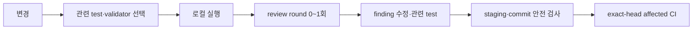

# LunchTime 검증 게이트와 CI 흐름

로컬과 CI는 변경에 영향을 받는 검증만 실행합니다. 모든 candidate에 공통
validator 묶음, 고정 heavy regression group 또는 evidence lineage를 요구하지
않습니다.

## 한눈에 보기

테스트 선택 순서는 [BDD/ATDD 테스트 표준](./02_testing_standard.md)의
`direct case/suite → affected target → affected subsystem → global`입니다.

## 로컬 검증 선택

| 변경 또는 단계 | 실행할 검증 |
|---|---|
| 앱 기능·버그 | 바뀐 행동의 direct test case 또는 suite |
| 한 target의 공유 interface | affected target test |
| 여러 target의 subsystem 경계 | affected subsystem test |
| Markdown 설명 | `git diff --check`; artifact validator가 있는 계약 문서는 해당 validator |
| PRD·Policy·제품 문서 validator | `validate-product-docs`와 바뀐 validator의 direct test |
| 이슈 본문·work item 도구 | 대상 본문의 `validate-body` 또는 바뀐 도구의 direct test |
| commit | staged path 안전, `git diff --cached --check`, commit message 검사 |
| PR 본문 | PR 작성·갱신 단계의 PR body validator |
| 영향 불명·release 명시 | global test |

제품 문서 validator, MVP bootstrap, commit path, PR body validator를 모든
변경의 공통 pre-review gate로 묶지 않습니다. 각 artifact를 바꾸거나 해당
수명주기 단계에 들어갈 때만 실행합니다.

Review 전에 기능 회귀 전체를 별도 gate로 돌리지 않습니다. 관련 test 결과가
기능 회귀의 증거이고 reviewer는 요구사항·설계·보안·테스트 공백을 검토합니다.

## Review finding closure

같은 review round의 finding을 모아 메인 세션이 타당성을 확인하고 한 번에
수정합니다. 이후에는 다음만 수행합니다.

1. finding이 지목한 diff 확인
2. 해당 동작의 direct case·suite 재실행
3. 필요할 때만 affected target으로 확대
4. finding별 해소 여부 기록

Reviewer를 다시 호출하거나 이전·현재 tree 사이의 delta review chain을
만들지 않습니다. 수정이 범위·요구사항·아키텍처·신뢰 경계를 넓히면 검증
범위를 관성적으로 넓히지 않고 blocker 또는 후속 이슈로 분리합니다.

## CI 선택

CI는 base와 exact PR head의 경로 및 build graph를 사용해 같은 테스트 사다리를
적용합니다.

- docs·tooling-only 변경에는 macOS 앱 runner를 할당하지 않습니다.
- 앱 변경에는 direct suite를 우선하고 분리할 수 없을 때 affected target을
  실행합니다.
- 하네스 owner 변경에는 해당 owner의 validator·direct contract test만
  실행합니다.
- 공유 workflow, build manifest, dependency, toolchain 또는 경로 분류 자체가
  바뀌어 영향을 한정할 수 없을 때만 subsystem 또는 global로 넓힙니다.
- `workflow_dispatch`, release 검증처럼 호출 목적이 전체 확인인 경우 global을
  선택할 수 있습니다.

Required check는 선택 결과와 실제 `success`·`skipped`를 결속하는 가벼운
aggregate일 수 있습니다. required라는 이유만으로 모든 고비용 job을
실행하지 않습니다. PR 제목·본문·Draft·base·head 같은 metadata 검증은 앱
테스트와 분리합니다.

## 실패와 재실행

- 실패를 발견하면 아직 시작하지 않은 더 넓은 검증을 중단하고 원인을
  확인합니다.
- 수정 뒤에는 실패한 case와 수정 영향으로 새로 필요한 범위만 실행합니다.
- shared interface까지 바뀌었을 때만 affected target 또는 subsystem으로
  한 단계 넓힙니다.
- flaky 실패를 통과할 때까지 rerun하지 않습니다.
- 외부 쓰기나 CI 응답이 불명확하면 현재 상태를 재조회하고 완료된 실행이나
  쓰기를 중복 요청하지 않습니다.

로컬 통과 결과가 exact PR head와 같으면 같은 로컬 검증을 commit·PR 단계에서
반복하지 않습니다. 원격 CI는 head 환경에서 선택된 target을 한 번 실행하고,
PR에는 검증 대상, 선택 이유, 명령과 실제 결과만 기록합니다.
